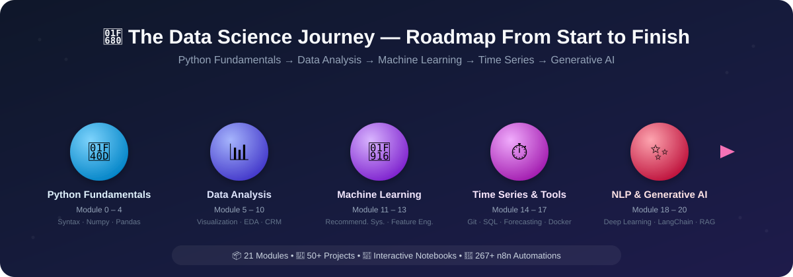

# Alican Kaya Data-Science-RoadMap

[Portfolio](https://alican-kaya.com/) | [LinkedIn](https://www.linkedin.com/in/alican-kaya-881650234/)

🇹🇷 [Türkçe](./README.md) &nbsp;|&nbsp; 🇬🇧 **English** &nbsp;|&nbsp; 🇪🇸 [Español](./README.es-ES.md)

---

    [](https://github.com/AlicanKaya192/Data-Science-RoadMap/actions/workflows/python-app.yml)

   

> [!CAUTION]
> Due to the high interest this project has received, the Git LFS data quota can fill up quickly. If you clone the repository while the quota is full, PDF documents and datasets will download incomplete. To access all files in full, please use the 'Download ZIP' option on the GitHub repository.

---



> ### *From Python to Generative AI — A Comprehensive Data Science Journey* 🚀

### ✨ Highlights

| | |
|---|---|
| 📦 **21 Modules** | End-to-end curriculum from basic Python to Generative AI |
| 🧪 **50+ Applications & Projects** | Hands-on exercises with real datasets |
| 📓 **Interactive Notebooks** | Jupyter Notebooks with executed outputs in visualization-heavy modules |
| 🤖 **267+ n8n Automations** | A ready-to-use AI workflow collection |
| 📄 **100+ PDF Documents** | Detailed theoretical explanations and reference materials |
| ✅ **CI-Backed** | Codebase validated with lint + smoke tests on every push |

### 🛠️ Tech Stack

     

     

     

## 📑 Table of Contents
> **Note:** The folders in this repository are numbered according to the learning order. Each module's detailed content lives in its own folder's `README.md`. Click a module name in the table below to jump to it.

* [📌 About the Repository](#-about-the-repository)
* [📚 Learning Roadmap and Contents](#-learning-roadmap-and-contents)
* [📂 Extra Projects and Resources](#-extra-projects-and-resources)
  * [🔄 n8n Automation Collection (267+ Ready Workflows)](#-n8n-automation-collection-267-ready-workflows)
* [📖 Project Status and Progress](#-project-status-and-progress)
* [⭐ Star History](#-star-history)
* [💡 Recommended Study Methods](#-recommended-study-methods)
* [🤝 Contributing](#-contributing)
* [📜 License](#-license)

[⬆️ Back to Top](#-table-of-contents)

---

## 📚 Learning Roadmap and Contents

| # | Module | Key Topics |
|:-:|---|---|
| 0 | [Python Fundamentals](./0-Python_Temelleri/README.md) | Introduction, data types, OOP, file/database operations |
| 1 | [Working Environment Setup](./01-Çalışma_Ortamı_Ayarları/README.md) | Virtual environments, package management |
| 2 | [Data Structures](./02-Veri_Yapıları/README.md) | String, List, Dictionary, Tuple, Set |
| 3 | [Functions, Conditions, Loops and Comprehensions](./03-Fonksiyonlar,_Koşullar,_Döngüler_anlamalar/README.md) | `if-else`, loops, `lambda`, `map`/`filter`, comprehensions |
| 4 | [Exercises (Python and List Comprehensions)](./04-Egzersizler_Python_ve_List_Comprehensions_/README.md) | Reinforcement exercises |
| 5 | [Numpy](./05-Numpy/README.md) | Array creation, indexing, fancy indexing, mathematical operations |
| 6 | [Pandas](./06-Pandas/README.md) | Series/DataFrame, selection, grouping, `apply`/`lambda`, join |
| 7 | [Data Visualization (Matplotlib & Seaborn)](./07-Veri_Görselleştirme_Matplotlib_&_Seaborn/README.md) | Line, bar, histogram, and scatter plot charts |
| 8 | [Advanced Functional Exploratory Data Analysis (EDA)](./08-Gelişmiş_Fonksiyonel_Keşifçi_Veri_Analizi/README.md) | Categorical/numerical analysis, target variable, correlation |
| 9 | [CRM Analytics](./09-CRM_Analitik/README.md) | RFM, Customer Lifetime Value (CLTV) |
| 10 | [Measurement Problems](./10-Ölçümleme_Problemleri/README.md) | Product/review scoring & ranking, A/B Testing |
| 11 | [Recommendation Systems](./11-Tavsiye_Sistemleri/README.md) | Association rules, content/collaborative filtering, matrix factorization |
| 12 | [Feature Engineering](./12-Feature_Engineering_Özellik_Mühendisliği_/README.md) | Outliers/missing values, encoding, feature extraction |
| 13 | [Machine Learning](./13-Machine_Learning_Makine_Öğrenimi_/README.md) | Regression, KNN, CART, tree methods, case studies |
| 14 | [GIT](./14-GIT/README.md) | Version control fundamentals and advanced usage |
| 15 | [SQL](./15-SQL/README.md) | Database management, querying |
| 16 | [Time Series](./16-Time_Series/README.md) | Smoothing, ARIMA/SARIMA, forecasting with LightGBM |
| 17 | [Docker](./17-Docker/README.md) | Containerization fundamentals |
| 18 | [Deep Learning Path ↗](https://github.com/AlicanKaya192/Deep_Learning_Path) | *(Separate repository)* |
| 19 | [Natural Language Processing (NLP)](./19-Natural_Language_Processing_(NLP)/README.md) | Text preprocessing, sentiment analysis, classification |
| 20 | [Generative AI & Prompt Engineering](./20-Generative_AI_and_Prompt_Engineer/README.md) | LLMs, LangChain, RAG, autonomous agents, fine-tuning |

---

## 📌 About the Repository

This repository is a comprehensive resource containing the notes, sample code, and projects I created while learning the Python programming language. Following a **Data Science and Machine Learning** roadmap, it offers a structure that spans from basic Python topics to advanced data analysis, feature engineering, and machine learning models.

My goal is to document what I've learned along the way in an organized manner, and to build a useful guide for others walking a similar path.

[⬆️ Back to Top](#-table-of-contents)

---

> [!CAUTION]
> ## ⚠️ Critical: Installing the Required Dependencies
>
> To run the code in this repository, you need to install every library listed in **`requirements.txt`**.
>
> ### What is `requirements.txt`?
> This file lists the Python libraries the project needs: **pandas**, **numpy**, **scikit-learn**, **matplotlib**, **seaborn**, **xgboost**, **lightgbm**, **catboost**, **streamlit**, **openai**, **google.generativeai**, and many other data science, machine learning, and generative AI libraries.
>
> `requirements.txt` now installs three separate files together, for backward compatibility. If you only care about one section, you can install the relevant file on its own for a lighter, faster setup:
> - **`requirements-core.txt`** — Modules 0-13, 16 (Classic Data Science & Machine Learning)
> - **`requirements-nlp.txt`** — Module 19 (Natural Language Processing)
> - **`requirements-genai.txt`** — Module 20 (Generative AI, LangChain, Agents)
>
> ### Installation Steps:
> ```bash
> # 1. Clone the repository
> git clone https://github.com/AlicanKaya192/Data-Science-RoadMap.git
>
> # 2. Go to the project directory
> cd Data-Science-RoadMap
>
> # 3. (Recommended) Create and activate a virtual environment
> python -m venv venv
> # Windows:
> venv\Scripts\activate
> # macOS/Linux:
> source venv/bin/activate
>
> # 4. Install all dependencies
> pip install -r requirements.txt
> ```
>
> **Note:** Some libraries (e.g. `google.generativeai`, `openai`) may require an API key. For Module 20 (Generative AI), copy [`20-Generative_AI_and_Prompt_Engineer/.env.example`](./20-Generative_AI_and_Prompt_Engineer/.env.example) to `.env` and fill it in with your own keys.

---

## 📂 Extra Projects and Resources

- **Armut ARL Project:** A real-world scenario built around Association Rule Learning.
- **CheatSheets:** Quick-reference sheets for Python, Pandas, Numpy, Matplotlib, Seaborn, SQL, Docker, Machine Learning, and AI Agents.
- **[Datasets](./Datasets_Genel_/README.md):** Archive of the datasets used throughout the exercises. See the link for source and license notes on third-party datasets.
- **Interview Questions:** Questions and solutions to prepare for technical interviews.
- **Mentor Solutions:** Alternative, professional-grade solutions to sample problems.
- **Kahoot! Questions:** Fun quizzes to test what you've learned.
- **[Global CO₂ Analysis & Future Projections](https://github.com/Miuul-Project/Global-CO--Analysis---Future-Projections):** A project on global CO₂ emissions analysis and future projections, including time series analysis, data visualization, and forecasting models.
    > **Note:** This project is best reviewed after the **Machine Learning (13)** and **Time Series (16)** topics.
- **[21 Different Python Projects](https://github.com/AlicanKaya192/21-Farkli-Python-Projeleri):** A collection of 21 projects, beginner to advanced, prepared for practicing along your Python journey — web scraping, a digital desktop clock, QR code generation, and more.
    > **Note:** These projects can be reviewed independently after the **Python Fundamentals (0)** section.
- **[CS Comprehensive Terminology Guide](./CS_Kapsamli_Terim_Rehberi.pdf):** A comprehensive reference guide summarizing 250+ computer science terms across 26 categories — computer networks, operating systems, databases, API/web development, cybersecurity, cloud computing/DevOps, AI/machine learning, data engineering, and basic mathematics.


### 🔄 n8n Automation Collection (267+ Ready Workflows)

> **n8n** is an open-source workflow automation platform. This collection contains **267+ ready-to-use automation workflows** across AI, email, social media, CRM, document processing, and more. Each workflow is a JSON structure, distributed as a `.txt` file, that imports directly into n8n.
>
> 📁 **Location:** `n8n-otomasyon/267 otomasyon (n8n) - HAZIR/`
> 📄 **Bonus:** `n8n Cheat Sheet Guide.pdf` — an n8n usage guide and tips

| Category | Workflow Count | Description |
|----------|:-:|-----------|
| [🤖 AI Chatbots](#-ai-chatbots) | 45 | Telegram, WhatsApp, Discord, Slack, and web-based AI chatbots |
| [📧 Email Automation](#-email-automation) | 28 | AI-powered classification, summarization, and auto-reply for Gmail and Outlook |
| [📝 Content Creation & SEO](#-content-creation--seo) | 25 | Blog, WordPress, social media content, and SEO optimization |
| [📊 Data Analysis & Reporting](#-data-analysis--reporting) | 20 | Google Analytics, data summarization, sentiment analysis, and reporting |
| [🧠 RAG & Vector Databases](#-rag--vector-databases) | 25 | Retrieval-Augmented Generation with Pinecone, Qdrant, Supabase, ChromaDB |
| [🤖 AI Agents & Autonomous Systems](#-ai-agents--autonomous-systems) | 22 | LangChain agents, tool use, autonomous research, and ReAct |
| [📱 Social Media Automation](#-social-media-automation) | 15 | Twitter/X, Instagram, LinkedIn, Pinterest, and YouTube automations |
| [📄 Document & PDF Processing](#-document--pdf-processing) | 18 | PDF parsing, invoice extraction, CV analysis, and OCR |
| [🖼️ Image & Audio Processing](#️-image--audio-processing) | 16 | DALL-E, Flux, Stable Diffusion, TTS, STT, and multimodal operations |
| [👔 HR & Human Resources](#-hr--human-resources) | 12 | CV screening, candidate evaluation, job postings, and interview automation |
| [💼 CRM & Sales](#-crm--sales) | 14 | Lead management, customer tracking, Pipedrive, HubSpot, and sales automation |
| [🕷️ Web Scraping & Data Extraction](#️-web-scraping--data-extraction) | 12 | Web scraping, Hacker News, Reddit, data collection and transformation |
| [🔒 Security & IT Ops](#-security--it-ops) | 8 | SIEM, PII cleanup, security bots, and IT support automation |
| [🔧 Tools & Integrations](#-tools--integrations) | 12 | Notion, Google Drive, Todoist, API templates, and helper tools |

---

<details>
<summary><b>🤖 AI Chatbots</b></summary>

| # | Workflow Name | Platform / Integration | Description |
|:-:|-------------|----------------------|----------|
| 1 | AI agent chat | General | Basic AI agent chat template |
| 2 | AI chatbot that can search the web | Web Search | An AI chatbot that can perform web searches |
| 3 | AI Voice Chat using Webhook, Memory Manager, OpenAI, Gemini & ElevenLabs | Webhook, ElevenLabs | Voice AI chat combining OpenAI + Gemini + ElevenLabs |
| 4 | AI Voice Chatbot with ElevenLabs & OpenAI | ElevenLabs | Voice AI chatbot for customer service and restaurants |
| 5 | Chat with OpenAI's GPT via Telegram Bot | Telegram, OpenAI | Chat with GPT via Telegram |
| 6 | Chat with local LLMs using n8n and Ollama | Ollama | Chatting with local LLMs (Ollama integration) |
| 7 | Chat with OpenAI Assistant (by adding a memory) | OpenAI Assistants | Memory-enabled OpenAI Assistant chat |
| 8 | Chat Assistant with Postgres Memory & API Calling | PostgreSQL, OpenAI | An assistant with Postgres memory and API-calling ability |
| 9 | Telegram AI Chatbot | Telegram | Telegram AI chatbot |
| 10 | Telegram AI bot with LangChain nodes | Telegram, LangChain | LangChain-based Telegram AI bot |
| 11 | Telegram AI bot assistant (voice & text) | Telegram | Telegram AI assistant with voice and text support |
| 12 | Telegram Bot with Supabase memory & OpenAI assistant | Telegram, Supabase | Telegram bot with Supabase memory + OpenAI Assistant integration |
| 13 | Agentic Telegram AI bot with LangChain & new tools | Telegram, LangChain | Advanced tool-enabled Telegram AI agent |
| 14 | Telegram chat with PDF | Telegram | Chat with a PDF over Telegram |
| 15 | 🤖🧠 AI Agent Chatbot + LONG TERM Memory + Telegram | Telegram | AI agent chatbot with long-term memory |
| 16 | 🐋🤖 DeepSeek AI Agent + Telegram + LONG TERM Memory | Telegram, DeepSeek | DeepSeek + long-term memory Telegram agent |
| 17 | Angie, Personal AI Assistant (Telegram Voice & Text) | Telegram | Personal AI assistant (voice + text) |
| 18 | 🤖 Telegram Messaging Agent for Text/Audio/Images | Telegram | Telegram agent supporting text, audio, and images |
| 19 | Building Your First WhatsApp Chatbot | WhatsApp | A WhatsApp chatbot starter template |
| 20 | Complete business WhatsApp AI-Powered RAG Chatbot | WhatsApp, RAG | RAG-based WhatsApp AI chatbot for businesses |
| 21 | Respond to WhatsApp Messages with AI | WhatsApp | Automatic AI replies to WhatsApp messages |
| 22 | Discord AI-powered bot | Discord | Discord AI chatbot |
| 23 | Creating a AI Slack Bot with Google Gemini | Slack, Gemini | Google Gemini-based Slack bot |
| 24 | Slack slash commands AI Chat Bot | Slack | AI chat via Slack slash commands |
| 25 | 🐋 DeepSeek V3 Chat & R1 Reasoning Quick Start | DeepSeek | Quick start with DeepSeek V3 chat and R1 reasoning |
| 26 | 🔐🦙🤖 Private & Local Ollama Self-Hosted AI Assistant | Ollama | A fully local, private Ollama AI assistant |
| 27 | Siri AI Agent: Apple Shortcuts powered voice template | Apple Shortcuts | Siri + Apple Shortcuts voice AI agent template |
| 28 | Text automations using Apple Shortcuts | Apple Shortcuts | Text automations built with Apple Shortcuts |
| 29 | AI-Powered Children's Arabic Storytelling on Telegram | Telegram | Arabic storytelling for children |
| 30 | AI-Powered Children's English Storytelling on Telegram | Telegram, OpenAI | English storytelling for children |
| 31 | LINE Assistant with Google Calendar & Gmail | LINE | LINE + Google Calendar + Gmail assistant |
| 32 | WordPress AI Chatbot with Supabase & OpenAI | WordPress, Supabase | AI chatbot for a WordPress site |
| 33 | Create a Branded AI-Powered Website Chatbot | Website | Creating a branded website AI chatbot |
| 34 | BambooHR AI-Powered Company Policies Chatbot | BambooHR | Chatbot for company policies and benefits |
| 35 | AI-powered WooCommerce Support Agent | WooCommerce | WooCommerce support AI agent |
| 36 | vAssistant for Hubspot Chat using OpenAI & Airtable | HubSpot, Airtable | AI assistant for HubSpot chat |
| 37 | Bitrix24 Chatbot Application with Webhook Integration | Bitrix24 | Bitrix24 CRM chatbot integration |
| 38 | Ask a human for help when the AI doesn't know | General | Escalate to a human when the AI doesn't know the answer |
| 39 | Conversational Interviews with AI Agents & n8n Forms | n8n Forms | Conversational-style interviews with AI |
| 40 | AI agent for Instagram DM/inbox (Manychat + OpenAI) | Instagram, ManyChat | Instagram DM AI agent integration |
| 41 | Chat with Postgresql Database | PostgreSQL | Chatting with a PostgreSQL database |
| 42 | Chat with a Google Sheet using AI | Google Sheets | Chatting with a Google Sheet via AI |
| 43 | Chat with your event schedule from Google Sheets in Telegram | Google Sheets, Telegram | Chat about your event schedule via Telegram |
| 44 | Enhance Customer Chat by Buffering Messages (Twilio & Redis) | Twilio, Redis | Improving customer chat by buffering messages |
| 45 | IT Ops AI SlackBot - Chat with your knowledge base | Slack | IT knowledge-base Slack chatbot |

</details>

<details>
<summary><b>📧 Email Automation</b></summary>

| # | Workflow Name | Platform / Integration | Description |
|:-:|-------------|----------------------|----------|
| 1 | A Very Simple "Human in the Loop" Email Response System | IMAP, AI | Human-approved AI email reply system |
| 2 | AI-Powered Email Automation: Summarize & Respond with RAG | Email, RAG | Email summarization and replies with RAG |
| 3 | AI-powered email processing autoresponder (Yes/No) | Email | AI-powered autoresponder (approve/reject) |
| 4 | Auto Categorise Outlook Emails with AI | Outlook | Categorizing Outlook emails with AI |
| 5 | Auto-label incoming Gmail messages with AI | Gmail | Labeling Gmail messages with AI |
| 6 | Basic Automatic Gmail Email Labelling with OpenAI | Gmail, OpenAI | Automatic Gmail labeling with OpenAI |
| 7 | Compose reply draft in Gmail with OpenAI Assistant | Gmail, OpenAI | Drafting AI replies in Gmail |
| 8 | Effortless Email Management with AI Summarization & Review | Email | Email management and summarization with AI |
| 9 | Email Subscription Service with n8n Forms, Airtable & AI | n8n Forms, Airtable | AI-powered email subscription service |
| 10 | Email Summary Agent | Email | Email summary agent |
| 11 | Gmail AI Auto-Responder: Draft Replies to incoming emails | Gmail | Drafting automatic Gmail reply drafts |
| 12 | Microsoft Outlook AI Email Assistant | Outlook, Monday, Airtable | Outlook AI email assistant |
| 13 | Modular & Customizable AI-Powered Email Routing | Email, eCommerce | Modular email routing for e-commerce |
| 14 | Send a ChatGPT email reply and save to Google Sheets | Gmail, Google Sheets | ChatGPT email replies + Google Sheets logging |
| 15 | Send specific PDF attachments from Gmail to Google Drive | Gmail, Google Drive | Sending Gmail PDF attachments to Google Drive |
| 16 | Analyze & Sort Suspicious Email Contents with ChatGPT | Gmail, ChatGPT | Analyzing and sorting suspicious emails with AI |
| 17 | Analyze Suspicious Email Contents with ChatGPT Vision | Gmail, GPT-4 Vision | Analyzing suspicious email content with vision AI |
| 18 | create e-mail responses with Fastmail & OpenAI | Fastmail, OpenAI | Email replies with Fastmail + OpenAI |
| 19 | Extract spending history from Gmail to Google Sheet | Gmail, Google Sheets | Extracting spending history from Gmail |
| 20 | Summarize your emails with AI and send to Line messenger | Email, LINE | Sending email summaries to LINE |
| 21 | Turn Emails into AI-Enhanced Tasks in Notion | Gmail, Notion, Airtable | Turning emails into Notion tasks with AI |
| 22 | 📈 Receive Daily Market News to Microsoft Outlook | Outlook, FT.com | Daily market news delivered to Outlook |
| 23 | Classify lemlist replies using OpenAI | lemlist, OpenAI | Classifying lemlist replies with AI |
| 24 | lemlist + GPT-3: Supercharge sales workflows | lemlist, GPT-3 | Supercharging sales email workflows |
| 25 | AI-Powered Information Monitoring with OpenAI & Slack | OpenAI, Google Sheets, Slack | AI-powered information monitoring and alerts |
| 26 | Reconcile Rent Payments with Excel & OpenAI | Excel, OpenAI | Reconciling rent payments with AI |
| 27 | Handling Appointment Leads with Twilio, Cal.com & AI | Twilio, Cal.com | Appointment lead tracking and follow-ups |
| 28 | Qualifying Appointment Requests with AI & n8n Forms | n8n Forms | Qualifying appointment requests with AI |

</details>

<details>
<summary><b>📝 Content Creation & SEO</b></summary>

| # | Workflow Name | Platform / Integration | Description |
|:-:|-------------|----------------------|----------|
| 1 | Automate Blog Creation in Brand Voice with AI | Blog | Generating on-brand blog content with AI |
| 2 | Automate Content Generator for WordPress with DeepSeek R1 | WordPress, DeepSeek | WordPress content generation with DeepSeek R1 |
| 3 | Author and Publish Blog Posts From Google Sheets | Google Sheets, WordPress | Publishing blog posts from Google Sheets |
| 4 | Write a WordPress post with AI (from keywords) | WordPress, AI | Generating a WordPress post from keywords |
| 5 | AI-Generated Summary Block for WordPress Posts | WordPress | AI summary blocks for WordPress posts |
| 6 | Auto-Categorize blog posts in WordPress using AI | WordPress | Categorizing WordPress posts with AI |
| 7 | Auto-Tag Blog Posts in WordPress with AI | WordPress | Tagging WordPress posts with AI |
| 8 | Generate SEO Seed Keywords Using AI | SEO | Generating SEO seed keywords with AI |
| 9 | Enrich FAQ sections on website pages at scale with AI | SEO, Web | Enriching website FAQ sections with AI at scale |
| 10 | AI Social Media Caption Creator (Airtable) | Airtable, Social Media | Generating social media captions |
| 11 | Generate Instagram Content from Top Trends with AI | Instagram, AI Image | Trend-based Instagram content generation |
| 12 | Generate 9:16 Images from Content & Brand Guidelines | Image Generation | Generating 9:16 images per brand guidelines |
| 13 | OpenAI-powered tweet generator | Twitter/X | Generating tweets with OpenAI |
| 14 | Speed Up Social Media Banners With BannerBear | BannerBear | Fast social media banner generation |
| 15 | Hacker News to Video Content | Hacker News, Video | Turning Hacker News content into video |
| 16 | 🔍 Perplexity Research to HTML: AI-Powered Content | Perplexity AI | Turning Perplexity research into HTML content |
| 17 | 📚 Auto-generate documentation for n8n workflows with GPT | GPT, Docsify | Auto-generating documentation for n8n workflows |
| 18 | Dynamically generate a webpage from user request (OpenAI) | OpenAI | Dynamically generating a webpage from a user request |
| 19 | AI Youtube Trend Finder Based On Niche | YouTube | Niche-based YouTube trend finder |
| 20 | Optimize & Update Printify Title and Description | Printify | Optimizing Printify product titles/descriptions |
| 21 | Daily Podcast Summary | Podcast | Daily podcast summary |
| 22 | AI: Summarize podcast & enhance using Wikipedia | Podcast, Wikipedia | Podcast summarization enriched with Wikipedia |
| 23 | Share YouTube Videos with AI Summaries on Discord | YouTube, Discord | Sharing YouTube videos with AI summaries on Discord |
| 24 | Summarize YouTube Videos from Transcript | YouTube | Summarizing YouTube videos from transcripts |
| 25 | ⚡AI-Powered YouTube Video Summarization & Analysis | YouTube, AI | AI-powered YouTube video analysis and summarization |

</details>

<details>
<summary><b>📊 Data Analysis & Reporting</b></summary>

| # | Workflow Name | Platform / Integration | Description |
|:-:|-------------|----------------------|----------|
| 1 | AI Customer feedback sentiment analysis | AI, NLP | Sentiment analysis of customer feedback |
| 2 | Analyze feedback and send a message on Mattermost | Mattermost | Feedback analysis with a Mattermost notification |
| 3 | Analyze feedback using AWS Comprehend & Mattermost | AWS Comprehend | Sentiment analysis with AWS Comprehend |
| 4 | Create a Google Analytics Data Report with AI | Google Analytics | Generating a Google Analytics report with AI |
| 5 | Send Google Analytics data to AI & save to Baserow | Google Analytics, Baserow | Analyzing Analytics data with AI, saving to Baserow |
| 6 | Visualize your SQL Agent queries with OpenAI & Quickchart | SQL, Quickchart | Visualizing SQL query results with AI |
| 7 | Sentiment Analysis Tracking on Support Issues (Linear & Slack) | Linear, Slack | Sentiment tracking on support tickets |
| 8 | Summarize Google Sheets form feedback via GPT-4 | Google Sheets, GPT-4 | Summarizing Google Forms feedback |
| 9 | Summarize SERPBear data with AI & save to Baserow | SERPBear, Baserow | Summarizing SEO data with AI |
| 10 | Summarize Umami data with AI & save to Baserow | Umami, Baserow | Summarizing Umami analytics data with AI |
| 11 | AI Fitness Coach: Strava Data Analysis & Training Insights | Strava | AI-powered Strava fitness data analysis |
| 12 | Analyze tradingview.com charts with Chrome extension & OpenAI | TradingView, OpenAI | Analyzing TradingView charts with AI |
| 13 | AI Crew to Automate Fundamental Stock Analysis | AI Crew | Automated fundamental stock analysis |
| 14 | AI-Powered RAG Workflow For Stock Earnings Report Analysis | RAG, Finance | AI analysis of stock earnings reports |
| 15 | Monthly Spotify Track Archiving & Playlist Classification | Spotify | Monthly Spotify track archiving and classification |
| 16 | UTM Link Creator & QR Code Generator with GA Reports | Google Analytics | UTM link + QR code generation with GA reports |
| 17 | Add positive feedback messages to a table in Notion | Notion | Logging positive feedback to a Notion table |
| 18 | Prepare CSV files with GPT-4 | GPT-4 | Preparing CSV files with GPT-4 |
| 19 | Force AI to use a specific output format | AI | Forcing a specific AI output format |
| 20 | 🚀 Local Multi-LLM Testing & Performance Tracker | Ollama | Local multi-LLM testing and performance tracking |

</details>

<details>
<summary><b>🧠 RAG & Vector Databases</b></summary>

| # | Workflow Name | Platform / Integration | Description |
|:-:|-------------|----------------------|----------|
| 1 | Ask questions about a PDF using AI | PDF, RAG | Asking AI questions about a PDF document |
| 2 | Chat with PDF docs using AI (quoting sources) | PDF, RAG | Chatting with a PDF while citing sources |
| 3 | AI Agent To Chat With Files In Supabase Storage | Supabase | Chatting with files in Supabase Storage |
| 4 | AI Agent to chat with Supabase/PostgreSQL DB | Supabase, PostgreSQL | Chatting with a Supabase/PostgreSQL database |
| 5 | AI Agent to chat with your Search Console Data | Google Search Console | Chatting with Search Console data |
| 6 | AI Agent to chat with Airtable and analyze data | Airtable | Chatting with and analyzing Airtable data |
| 7 | AI chat with any data source (n8n workflow tool) | n8n | AI chat with any data source |
| 8 | AI: Ask questions about any data source (n8n retriever) | n8n | Asking questions of any data source |
| 9 | Chat with GitHub API Documentation: RAG with Pinecone & OpenAI | GitHub, Pinecone | RAG chat with GitHub API documentation |
| 10 | Notion to Pinecone Vector Store Integration | Notion, Pinecone | Vectorizing Notion pages into Pinecone |
| 11 | Store Notion's Pages as Vectors into Supabase with OpenAI | Notion, Supabase | Storing Notion pages as vectors in Supabase |
| 12 | Upsert huge documents in a vector store (Supabase & Notion) | Supabase, Notion | Upserting large documents into a vector store |
| 13 | Supabase Insertion & Upsertion & Retrieval | Supabase | Supabase vector database operations |
| 14 | Building RAG Chatbot for Movie Recommendations with Qdrant | Qdrant, OpenAI | RAG movie recommendation chatbot |
| 15 | Build a Financial Documents Assistant (Qdrant & Mistral) | Qdrant, Mistral | AI assistant for financial documents |
| 16 | Build a Tax Code Assistant (Qdrant, Mistral & OpenAI) | Qdrant, Mistral | AI assistant for tax code questions |
| 17 | Recipe Recommendations with Qdrant and Mistral | Qdrant, Mistral | Recipe recommendation system |
| 18 | Breakdown Documents into Study Notes (MistralAI & Qdrant) | Qdrant, Mistral | Turning documents into study notes |
| 19 | Customer Insights with Qdrant, Python & Information Extractor | Qdrant, Python | Extracting customer insights |
| 20 | Survey Insights with Qdrant, Python & Information Extractor | Qdrant, Python | Extracting survey insights |
| 21 | RAG Chatbot for Company Documents (Google Drive & Gemini) | Google Drive, Gemini | RAG chatbot for company documents |
| 22 | RAG Context-Aware Chunking (Google Drive to Pinecone) | Google Drive, Pinecone | Context-aware document chunking |
| 23 | KB Tool - Confluence Knowledge Base | Confluence | Confluence knowledge base tool |
| 24 | Notion knowledge base AI assistant | Notion | Notion knowledge base AI assistant |
| 25 | Notion AI Assistant Generator | Notion | Notion AI assistant generator |

</details>

<details>
<summary><b>🤖 AI Agents & Autonomous Systems</b></summary>

| # | Workflow Name | Platform / Integration | Description |
|:-:|-------------|----------------------|----------|
| 1 | AI agent that can scrape webpages | Web Scraping | An AI agent capable of scraping webpages |
| 2 | AI Agent with Ollama for current weather & wiki | Ollama | Weather and Wikipedia AI agent |
| 3 | AI Agent / Google Calendar assistant using OpenAI | Google Calendar | Google Calendar AI assistant |
| 4 | AI Agent for project management & meetings (Airtable & Fireflies) | Airtable, Fireflies | Project management and meeting AI agent |
| 5 | AI Agent for realtime insights on meetings | Meetings | Real-time meeting insight agent |
| 6 | Host Your Own AI Deep Research Agent (n8n, Apify, OpenAI o3) | Apify, OpenAI o3 | Self-hosted deep-research AI agent |
| 7 | Open Deep Research - AI-Powered Autonomous Research | Research | Open-source autonomous research workflow |
| 8 | Autonomous AI crawler | Web | Autonomous AI web crawler |
| 9 | Advanced AI Demo (AI Developers #14 meetup) | General | Advanced AI demo workflow |
| 10 | Custom LangChain agent written in JavaScript | LangChain, JS | Custom LangChain agent written in JavaScript |
| 11 | OpenAI Assistant workflow: upload file, create, chat | OpenAI Assistants | OpenAI Assistant: upload file, create, chat |
| 12 | OpenAI assistant with custom tools | OpenAI Assistants | OpenAI Assistant with custom tools |
| 13 | Build an OpenAI Assistant with Google Drive Integration | OpenAI, Google Drive | OpenAI Assistant with Google Drive integration |
| 14 | Make OpenAI Citation for File Retrieval RAG | OpenAI | File-citation RAG with OpenAI |
| 15 | Talk to your SQLite database with a LangChain AI Agent | SQLite, LangChain | Chatting with a SQLite database via LangChain |
| 16 | Generate SQL queries from schema only (AI-powered) | SQL, AI | AI-generated SQL queries from schema alone |
| 17 | Query n8n Credentials with AI SQL Agent | n8n, SQL | Querying n8n credentials with an AI SQL agent |
| 18 | Using External Workflows as Tools in n8n | n8n | Using external workflows as tools in n8n |
| 19 | Introduction to the HTTP Tool | n8n | Introduction to the HTTP tool |
| 20 | 🔥📈🤖 AI Agent for n8n Creators Leaderboard | n8n | AI agent for the n8n creators leaderboard |
| 21 | 🤖🧑‍💻 AI Agent for Top n8n Creators Leaderboard Reporting | n8n | Reporting agent for top n8n creators |
| 22 | Proxmox AI Agent with n8n & Generative AI | Proxmox | Proxmox server management AI agent |

</details>

<details>
<summary><b>📱 Social Media Automation</b></summary>

| # | Workflow Name | Platform / Integration | Description |
|:-:|-------------|----------------------|----------|
| 1 | AI-Powered Social Media Amplifier | Social Media | AI-powered social media amplifier |
| 2 | Social Media Analysis and Automated Email Generation | Social Media, Email | Social media analysis + automated email |
| 3 | Post New YouTube Videos to X | YouTube, Twitter/X | Posting new YouTube videos to X |
| 4 | Create dynamic Twitter profile banner | Twitter/X | Creating a dynamic Twitter profile banner |
| 5 | Update Twitter banner using HTTP request | Twitter/X | Updating a Twitter banner via HTTP request |
| 6 | Twitter Virtual AI Influencer | Twitter/X | A virtual AI influencer on Twitter |
| 7 | Upload to Instagram and TikTok from Google Drive | Instagram, TikTok | Uploading Google Drive content to Instagram/TikTok |
| 8 | Automate Pinterest Analysis & AI Content Suggestions | Pinterest | Pinterest analysis and AI content suggestions |
| 9 | Automate LinkedIn Outreach with Notion & OpenAI | LinkedIn, Notion | LinkedIn outreach automation |
| 10 | Reddit AI digest | Reddit | Reddit AI digest |
| 11 | Send daily translated Calvin and Hobbes Comics to Discord | Discord | Daily translated Calvin and Hobbes comic strips |
| 12 | Telegram to Spotify with OpenAI | Telegram, Spotify | Adding music to Spotify from Telegram via AI |
| 13 | Automate Sales Meeting Prep with AI & APIFY (WhatsApp) | WhatsApp, Apify | Sales meeting prep + WhatsApp notification |
| 14 | Detect toxic language in Telegram messages | Telegram | Detecting toxic language in Telegram messages |
| 15 | Get Airtable data via AI and Obsidian Notes | Airtable, Obsidian | Bringing Airtable data into Obsidian notes via AI |

</details>

<details>
<summary><b>📄 Document & PDF Processing</b></summary>

| # | Workflow Name | Platform / Integration | Description |
|:-:|-------------|----------------------|----------|
| 1 | Invoice data extraction with LlamaParse & OpenAI | LlamaParse, OpenAI | Invoice data extraction with LlamaParse |
| 2 | Parse PDF with LlamaParse and save to Airtable | LlamaParse, Airtable | Parsing PDFs and saving to Airtable |
| 3 | Extract and process info from PDF (Claude & Gemini) | Claude, Gemini | Extracting PDF information with Claude and Gemini |
| 4 | Extract text from PDF & image using Vertex AI to CSV | Vertex AI, Gemini | Extracting text from PDF/images into CSV |
| 5 | Manipulate PDF with Adobe developer API | Adobe API | Manipulating PDFs with the Adobe API |
| 6 | Extract data from resume and create PDF with Gotenberg | Gotenberg | Extracting resume data and generating a PDF |
| 7 | AI Data Extraction with Dynamic Prompts (Airtable) | Airtable | Dynamic-prompt AI data extraction |
| 8 | AI Data Extraction with Dynamic Prompts (Baserow) | Baserow | Dynamic-prompt AI data extraction |
| 9 | Extract Information from Logo Sheet (forms, AI, Google Sheet) | Google Sheets, Airtable | Extracting information from a logo sheet |
| 10 | Extract license plate number from image via n8n form | n8n Forms | Extracting a license plate number from an image |
| 11 | Extract personal data with self-hosted LLM Mistral NeMo | Mistral NeMo | Extracting personal data with a local LLM |
| 12 | Convert URL HTML to Markdown Format & Get Page Links | Web | Converting page HTML to Markdown |
| 13 | Summarize the New Documents from Google Drive | Google Drive, Google Sheets | Summarizing new Google Drive documents |
| 14 | Transcribing Bank Statements To Markdown Using Gemini Vision | Gemini Vision | Converting bank statements to Markdown |
| 15 | ETL pipeline for text processing | ETL | An ETL pipeline for text processing |
| 16 | Analyse papers from Hugging Face with AI & store in Notion | Hugging Face, Notion | Analyzing Hugging Face papers with AI |
| 17 | Automated Hugging Face Paper Summary & Categorization | Hugging Face | Automated Hugging Face paper summarization |
| 18 | API Schema Extractor | API | An API schema extraction tool |

</details>

<details>
<summary><b>🖼️ Image & Audio Processing</b></summary>

| # | Workflow Name | Platform / Integration | Description |
|:-:|-------------|----------------------|----------|
| 1 | Configure your own Image Creation API Using DALL-E 3 | DALL-E 3 | An image-generation API built on DALL-E 3 |
| 2 | Image Creation with OpenAI and Telegram | OpenAI, Telegram | Image generation via OpenAI + Telegram |
| 3 | Flux AI Image Generator | Flux | Flux AI image generator |
| 4 | Flux Dev Image Generation (Fal.ai) to Google Drive | Fal.ai, Google Drive | Flux image generation saved to Drive |
| 5 | 🎨 Interactive Image Editor with FLUX.1 Fill Tool | Flux | Interactive image editing (inpainting) with Flux |
| 6 | Transform Image to Lego Style Using Line and DALL-E | LINE, DALL-E | Transforming an image into Lego style |
| 7 | Automate Image Validation Tasks using AI Vision | AI Vision | Automated image validation with AI Vision |
| 8 | Automatic Background Removal for Images in Google Drive | Google Drive | Automatic background removal for Drive images |
| 9 | Prompt-based Object Detection with Gemini 2.0 | Gemini 2.0 | Prompt-based object detection |
| 10 | Easy Image Captioning with Gemini 1.5 Pro | Gemini 1.5 Pro | Easy image captioning |
| 11 | Generating Image Embeddings via Textual Summarisation | AI | Generating image embeddings via text summarization |
| 12 | Build Your Own Image Search (AI Object Detection, CDN, ElasticSearch) | ElasticSearch | An image search engine with AI object detection |
| 13 | Narrating over a Video using Multimodal AI | Multimodal AI | Narrating a video with multimodal AI |
| 14 | OpenAI examples: ChatGPT, DALL-E 2, Whisper—5-in-1 | OpenAI | 5-in-1 OpenAI examples |
| 15 | Convert text to speech with OpenAI | OpenAI TTS | Text-to-speech with OpenAI |
| 16 | Generate Text-to-Speech Using ElevenLabs | ElevenLabs | Text-to-speech with ElevenLabs |
| 17 | Generate audio from text using OpenAI (Webhook TTS) | OpenAI, Webhook | Text-to-speech via webhook |
| 18 | Translate audio using AI | AI | Translating audio with AI |
| 19 | Translate Telegram audio messages with AI (55 languages) | Telegram | Translating Telegram voice messages (55 languages) |
| 20 | Transcribe Audio Files, Summarize with GPT-4, store in Notion | GPT-4, Notion | Transcribing, summarizing, and logging audio to Notion |

</details>

<details>
<summary><b>👔 HR & Human Resources</b></summary>

| # | Workflow Name | Platform / Integration | Description |
|:-:|-------------|----------------------|----------|
| 1 | AI Automated HR Workflow for CV Analysis & Evaluation | HR, AI | Automated CV analysis and candidate evaluation |
| 2 | AI-Powered Candidate Shortlisting for ERPNext | ERPNext | AI candidate shortlisting for ERPNext |
| 3 | CV Resume PDF Parsing with Multimodal Vision AI | Vision AI | Parsing resume PDFs with multimodal AI |
| 4 | CV Screening with OpenAI | OpenAI | CV screening with OpenAI |
| 5 | Screen Applicants With AI, notify HR & save to Google Sheet | AI, Google Sheets | Screening applicants and notifying HR |
| 6 | HR Job Posting and Evaluation with AI | HR | Job posting creation and evaluation with AI |
| 7 | Handling Job Application Submissions with AI & n8n Forms | n8n Forms | Managing job application submissions with AI |
| 8 | Spot Workplace Discrimination Patterns with AI | AI, HR | Detecting workplace discrimination patterns |
| 9 | HR & IT Helpdesk Chatbot with Audio Transcription | Chatbot | HR & IT helpdesk chatbot with audio transcription |
| 10 | Actioning Your Meeting Next Steps using Transcripts & AI | Meetings | Extracting action items from meeting transcripts |
| 11 | Daily meetings summarization with Gemini AI | Gemini | Daily meeting summarization (Gemini) |
| 12 | Zoom AI Meeting Assistant (mail summary, ClickUp tasks) | Zoom, ClickUp | Zoom meeting assistant + task creation |

</details>

<details>
<summary><b>💼 CRM & Sales</b></summary>

| # | Workflow Name | Platform / Integration | Description |
|:-:|-------------|----------------------|----------|
| 1 | AI-Driven Lead Management & Inquiry Automation (ERPNext) | ERPNext | AI-driven lead management for ERPNext |
| 2 | AI web researcher for sales | Web, AI | An AI web researcher for sales |
| 3 | Automate Competitor Research (Exa.ai, Notion, AI Agents) | Exa.ai, Notion | Automated competitor research |
| 4 | Qualify new leads in Google Sheets via GPT-4 | Google Sheets, GPT-4 | Qualifying leads in Google Sheets with GPT-4 |
| 5 | Qualify replies from Pipedrive persons with AI | Pipedrive | Qualifying Pipedrive replies with AI |
| 6 | Enrich Pipedrive Organization Data with GPT-4o & Slack | Pipedrive, Slack | Enriching Pipedrive organization data with AI |
| 7 | MongoDB AI Agent - Intelligent Movie Recommendations | MongoDB | Intelligent movie recommendations via MongoDB |
| 8 | Suggest meeting slots using AI | AI, Calendar | Suggesting meeting slots with AI |
| 9 | Personal Shopper Chatbot for WooCommerce (RAG, OpenAI) | WooCommerce, RAG | A personal-shopper chatbot for WooCommerce |
| 10 | Automate Your RFP Process with OpenAI Assistants | OpenAI Assistants | Automating the RFP process with AI |
| 11 | Customer Support Channel & Ticketing (Slack & Linear) | Slack, Linear | A customer support channel and ticketing system |
| 12 | Automate Customer Support Issue Resolution (AI Text Classifier) | AI | Resolving support issues with an AI classifier |
| 13 | Simple Expense Tracker with n8n Chat, AI Agent & Google Sheets | Google Sheets | A simple AI + Google Sheets expense tracker |
| 14 | Automate testimonials in Strapi with n8n | Strapi | Automating testimonial management in Strapi |

</details>

<details>
<summary><b>🕷️ Web Scraping & Data Extraction</b></summary>

| # | Workflow Name | Platform / Integration | Description |
|:-:|-------------|----------------------|----------|
| 1 | Ultimate Scraper Workflow for n8n | n8n | A comprehensive web scraper for n8n |
| 2 | AI Powered Web Scraping (Jina, Google Sheets, OpenAI) | Jina, Google Sheets | AI-powered web scraping (the easy way) |
| 3 | ✨ Vision-Based AI Agent Scraper (Google Sheets, ScrapingBee, Gemini) | ScrapingBee, Gemini | A vision-based AI scraper |
| 4 | Scrape and summarize webpages with AI | Web, AI | Scraping and summarizing webpages with AI |
| 5 | Scrape and summarize posts without RSS (AI, NocoDB) | NocoDB | Scraping and summarizing sites without RSS |
| 6 | Scrape Trustpilot Reviews (DeepSeek + OpenAI Sentiment) | Trustpilot, DeepSeek | Trustpilot review scraping + sentiment analysis |
| 7 | Hacker News Job Listing Scraper & Parser | Hacker News | Scraping and parsing Hacker News job listings |
| 8 | Hacker News Throwback Machine | Hacker News | Popular Hacker News content from past years |
| 9 | Learn Anything from HN - Resource Recommendations | Hacker News | Resource recommendations sourced from HN |
| 10 | Extract insights & analyse YouTube comments via AI Agent | YouTube | YouTube comment analysis via an AI agent |
| 11 | Deduplicate Scraping AI Grants for Eligibility | AI, Web | Scraping and deduplicating AI grants for eligibility |
| 12 | Enrich Property Inventory Survey (Image Recognition & AI) | AI Vision | Enriching a property inventory survey with AI |

</details>

<details>
<summary><b>🔒 Security & IT Ops</b></summary>

| # | Workflow Name | Platform / Integration | Description |
|:-:|-------------|----------------------|----------|
| 1 | Automate SIEM Alert Enrichment (MITRE ATT&CK, Qdrant, Zendesk) | SIEM, Qdrant, Zendesk | SIEM alert enrichment (MITRE ATT&CK) |
| 2 | Enhance Security Operations with Qualys Slack Shortcut Bot | Qualys, Slack | A Slack bot for Qualys security operations |
| 3 | Remove PII from CSV Files with OpenAI | OpenAI | Removing PII from CSV files with AI |
| 4 | Visual Regression Testing with Apify & AI Vision | Apify, AI Vision | Visual regression testing with AI Vision |
| 5 | ChatGPT Automatic Code Review in Gitlab MR | GitLab, ChatGPT | Automatic AI code review on GitLab MRs |
| 6 | Classify new bugs in Linear with GPT-4 | Linear, GPT-4 | Classifying Linear bugs with GPT-4 |
| 7 | Venafi Cloud Slack Cert Bot | Venafi, Slack | A Slack bot for Venafi certificate management |
| 8 | Detect hallucinations using Ollama bespoke-minicheck | Ollama | Hallucination detection with a custom Ollama model |

</details>

<details>
<summary><b>🔧 Tools & Integrations</b></summary>

| # | Workflow Name | Platform / Integration | Description |
|:-:|-------------|----------------------|----------|
| 1 | Organise Your Local File Directories With AI | File System | Organizing local file directories with AI |
| 2 | Use AI to organize your Todoist Inbox | Todoist | Organizing your Todoist inbox with AI |
| 3 | Automate Screenshots with URLbox & Analyze with AI | URLbox | URL screenshots + AI analysis |
| 4 | Create, update, and get a profile in Humantic AI | Humantic AI | Managing a Humantic AI profile |
| 5 | Query Perplexity AI from your n8n workflows | Perplexity AI | Querying Perplexity AI from n8n |
| 6 | Use OpenRouter in n8n versions ≤1.78 | OpenRouter | Using OpenRouter in n8n |
| 7 | Fetch Dynamic Prompts from GitHub & Auto-Populate | GitHub | Fetching dynamic prompts from GitHub |
| 8 | Send a random recipe once a day to Telegram | Telegram | Sending a random recipe to Telegram daily |
| 9 | Intelligent Web Query & Semantic Re-Ranking (Brave, Gemini) | Brave, Gemini | Intelligent web querying and semantic re-ranking |
| 10 | Obsidian Notes Read Aloud using AI (Podcast Feed) | Obsidian | Reading Obsidian notes aloud with AI |
| 11 | Vector DB as Big Data Analysis Tool for AI Agents | Vector DB | Vector database as a big-data analysis tool (5 parts) |
| 12 | n8n Tips and Tricks | n8n | n8n tips and tricks |

</details>

> **📌 Note:** Each workflow file is a JSON structure that imports directly into the n8n platform. To use one:
> 1. In the n8n interface, use **Workflows → Import from File**.
> 2. Select and import the relevant `.txt` file.
> 3. Update the required API keys and connection details with your own account information.

[⬆️ Back to Top](#-table-of-contents)

---

## 📖 Project Status and Progress

  

All **21 modules** in the [Learning Roadmap](#-learning-roadmap-and-contents) table above are **fully completed**.

**Note:** The ordering of items 18, 19, and 20 may change as needed. Additional topics deemed necessary will be added over time, including relevant mathematical foundations.

[⬆️ Back to Top](#-table-of-contents)

---

## ⭐ Star History

[](https://star-history.com/#AlicanKaya192/Data-Science-RoadMap&Date)

> If you find this project useful, consider giving it a ⭐ — use the chart above to track its growth.

[⬆️ Back to Top](#-table-of-contents)

---

## 💡 Recommended Study Methods

1. **Follow the order:** Since each topic builds on the previous one, it's recommended to progress in folder-number order.
2. **Practice as you go:** Instead of just reading the code, use the data in the [`Datasets_Genel_`](./Datasets_Genel_/README.md) folder to run your own analyses.
3. **Study the projects:** In particular, work through the end-to-end pipelines in the `09-CRM_Analitik` and `13-Machine_Learning_Makine_Öğrenimi_` folders.

### Algorithm & Coding Practice Sites
* **Hackerrank:** For beginner and intermediate questions.
* **Codewars:** Small, practice-focused challenges.
* **Leetcode:** For intermediate/advanced users (do Hackerrank/Codewars first).
* **Spoj:** Questions only, no code editor. Best used after the other sites.

> **Note:** You can drop into these sites anytime for quick practice. It's recommended to spend more of your time on hands-on dataset practice.

[⬆️ Back to Top](#-table-of-contents)

---

## 🤝 Contributing

Contributions to improve these resources are very welcome — feel free to open a Pull Request or an issue.

### How to Contribute

```bash
# 1. Fork the repository (on GitHub)

# 2. Clone your fork
git clone https://github.com/YOUR_USERNAME/Data-Science-RoadMap.git

# 3. Create a new branch
git checkout -b feature/new-feature

# 4. Make your changes and commit
git add .
git commit -m "feat: description of the new feature"

# 5. Push your branch
git push origin feature/new-feature

# 6. Open a Pull Request on GitHub
```

> **📌 Contribution Guidelines:**
> - Use descriptive commit messages
> - Update the relevant README section for any newly added files
> - Add sufficient comments to code files
> - Follow the existing folder structure where possible
> - Before opening a PR, make sure tests pass with `pytest tests/` — every PR is automatically linted and tested via [GitHub Actions](./.github/workflows/python-app.yml)

---

## 📜 License

This project is licensed under the **MIT License**. See the [LICENSE](LICENSE) file for details.

> **Summary:** This repository is open source. You may use, modify, and redistribute its contents for personal, commercial, or educational purposes. However, attribution to the source and preservation of the license notice are required. Contributions back to the project's open-source nature are always appreciated.

[⬆️ Back to Top](#-table-of-contents)
