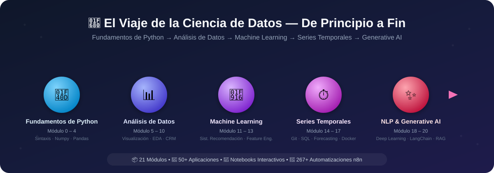

# Alican Kaya Data-Science-RoadMap

[Portfolio](https://alican-kaya.com/) | [LinkedIn](https://www.linkedin.com/in/alican-kaya-881650234/)

🇹🇷 [Türkçe](./README.md) &nbsp;|&nbsp; 🇬🇧 [English](./README.en.md) &nbsp;|&nbsp; 🇪🇸 **Español**

---

    [](https://github.com/AlicanKaya192/Data-Science-RoadMap/actions/workflows/python-app.yml)

   

> [!CAUTION]
>Debido al gran interés que ha despertado este proyecto, la cuota de datos de Git LFS se está agotando rápidamente. Si clona el repositorio cuando la cuota esté llena, los documentos PDF y los conjuntos de datos se descargarán incompletos. Para acceder a todos los archivos por completo, utilice la opción 'Descargar ZIP' (Download ZIP) en el repositorio de GitHub.

---



> ### *De Python a Generative AI: Un viaje completo de Ciencia de Datos* 🚀

### ✨ Destacados

| | |
|---|---|
| 📦 **22 Módulos** | Plan de estudios completo de Python básico a Generative AI y Reinforcement Learning |
| 🧪 **50+ Aplicaciones & Proyectos** | Trabajos prácticos con conjuntos de datos reales |
| 📓 **Notebooks Interactivos** | Jupyter Notebook con salidas ejecutadas en módulos centrados en visualización |
| 🤖 **267+ Automatizaciones n8n** | Colección de flujos de trabajo de IA listos para usar |
| 📄 **100+ Documentos PDF** | Explicaciones teóricas detalladas y materiales de referencia |
| ✅ **Soportado por CI** | Base de código validada con lint + pruebas smoke en cada push |

### 🛠️ Stack Tecnológico

     

     

     

## 📑 Tabla de Contenidos
> **Nota:** Las carpetas dentro del repositorio están numeradas según el orden de aprendizaje. El contenido detallado de cada módulo se encuentra en el archivo `README.md` de su propia carpeta. Por favor, haga clic en los nombres de los módulos de la tabla a continuación para navegar a cada módulo.

* [📌 Sobre el Repositorio](#-sobre-el-repositorio)
* [📚 Mapa de Aprendizaje y Contenidos](#-mapa-de-aprendizaje-y-contenidos)
* [📂 Proyectos y Recursos Adicionales](#-proyectos-y-recursos-adicionales)
  * [🔄 Colección de Automatizaciones n8n (267+ Flujos de Trabajo Listos)](#-colección-de-automatizaciones-n8n-267-flujos-de-trabajo-listos)
* [📖 Estado e Progreso del Proyecto](#-estado-e-progreso-del-proyecto)
* [💡 Métodos de Estudio Recomendados](#-métodos-de-estudio-recomendados)
* [🤝 Cómo Contribuir](#-cómo-contribuir)
* [📜 Licencia](#-licencia)

[⬆️ Volver al Inicio](#-tabla-de-contenidos)

---

## 📚 Mapa de Aprendizaje y Contenidos

| # | Módulo | Títulos de Temas |
|:-:|---|---|
| 0 | [Fundamentos de Python](./0-Python_Temelleri/README.md) | Introducción, tipos de datos, POO, operaciones de archivos/bases de datos |
| 1 | [Configuración del Entorno de Trabajo](./01-Çalışma_Ortamı_Ayarları/README.md) | Entorno virtual, gestión de paquetes |
| 2 | [Estructuras de Datos](./02-Veri_Yapıları/README.md) | String, List, Dictionary, Tuple, Set |
| 3 | [Funciones, Condiciones, Bucles y Comprehensions](./03-Fonksiyonlar,_Koşullar,_Döngüler_anlamalar/README.md) | `if-else`, bucles, `lambda`, `map`/`filter`, comprehensions |
| 4 | [Ejercicios (Python y List Comprehensions)](./04-Egzersizler_Python_ve_List_Comprehensions_/README.md) | Ejercicios de reforzamiento |
| 5 | [Numpy](./05-Numpy/README.md) | Creación de arrays, indexación, fancy index, operaciones matemáticas |
| 6 | [Pandas](./06-Pandas/README.md) | Series/DataFrame, selección, agrupación, `apply`/`lambda`, join |
| 7 | [Visualización de Datos (Matplotlib & Seaborn)](./07-Veri_Görselleştirme_Matplotlib_&_Seaborn/README.md) | Gráficos de líneas, barras, histogramas, scatter plot |
| 8 | [Análisis Exploratorio de Datos Avanzado (EDA)](./08-Gelişmiş_Fonksiyonel_Keşifçi_Veri_Analizi/README.md) | Análisis categórico/numérico, variable objetivo, correlación |
| 9 | [Analítica CRM](./09-CRM_Analitik/README.md) | RFM, Valor de Vida del Cliente (CLTV) |
| 10 | [Problemas de Medición](./10-Ölçümleme_Problemleri/README.md) | Puntuación/clasificación de productos/comentarios, Pruebas A/B |
| 11 | [Sistemas de Recomendación](./11-Tavsiye_Sistemleri/README.md) | Reglas de asociación, filtrado basado en contenido/colaborativo, factorización de matrices |
| 12 | [Ingeniería de Características (Feature Engineering)](./12-Feature_Engineering_Özellik_Mühendisliği_/README.md) | Valores atípicos/faltantes, codificación, extracción de características |
| 13 | [Machine Learning (Aprendizaje Automático)](./13-Machine_Learning_Makine_Öğrenimi_/README.md) | Regresión, KNN, CART, métodos de árboles, estudios de caso |
| 14 | [GIT](./14-GIT/README.md) | Fundamentos de control de versiones y uso avanzado |
| 15 | [SQL](./15-SQL/README.md) | Gestión de bases de datos, consultas |
| 16 | [Series Temporales](./16-Time_Series/README.md) | Suavización, ARIMA/SARIMA, predicción con LightGBM |
| 17 | [Docker](./17-Docker/README.md) | Fundamentos de contenedorización |
| 18 | [Ruta de Deep Learning ↗](https://github.com/AlicanKaya192/Deep_Learning_Path) | *(Repositorio separado)* |
| 19 | [Procesamiento de Lenguaje Natural (NLP)](./19-Natural_Language_Processing_(NLP)/README.md) | Preprocesamiento de texto, análisis de sentimiento, clasificación |
| 20 | [Generative AI & Prompt Engineering](./20-Generative_AI_and_Prompt_Engineer/README.md) | LLMs, LangChain, RAG, agentes autónomos, ajuste fino |
| 21 | [Reinforcement Learning](./21-Reinforcement_Learning/README.md) | Q-Learning, Policy Gradient (REINFORCE), conceptos de DQN, entornos Gymnasium |

---

## 📌 Sobre el Repositorio

Este repositorio es un recurso integral que contiene mis notas, ejemplos de código y proyectos creados durante mi proceso de aprendizaje del lenguaje de programación Python. Siguiendo el mapa de ruta de **Ciencia de Datos y Aprendizaje Automático**, ofrece una estructura que abarca desde temas básicos de Python hasta análisis de datos avanzado, ingeniería de características y modelos de aprendizaje automático.

Mi objetivo es documentar lo que he aprendido de manera organizada y crear una guía útil para aquellos que sigan un camino similar.

[⬆️ Volver al Inicio](#-tabla-de-contenidos)

---

> [!CAUTION]
> ## ⚠️ Crítico: Instalación de las Dependencias Requeridas
> 
> Para ejecutar el código de este repositorio, es necesario instalar todas las bibliotecas listadas en el archivo **`requirements.txt`**.
> 
> ### ¿Qué es `requirements.txt`?
> Este archivo contiene la lista de bibliotecas de Python que el proyecto necesita. Incluye: **pandas**, **numpy**, **scikit-learn**, **matplotlib**, **seaborn**, **xgboost**, **lightgbm**, **catboost**, **streamlit**, **openai**, **google.generativeai** y muchas otras bibliotecas de ciencia de datos, aprendizaje automático e IA generativa.
>
> Actualmente, `requirements.txt` instala tres archivos separados en conjunto con fines de compatibilidad. Si solo está interesado en una sección específica, puede instalar el archivo correspondiente por separado para una instalación más ligera/rápida:
> - **`requirements-core.txt`** — Módulos 0-13, 16, 21 (Ciencia de Datos Clásica, Aprendizaje Automático & Reinforcement Learning)
> - **`requirements-nlp.txt`** — Módulo 19 (Procesamiento de Lenguaje Natural)
> - **`requirements-genai.txt`** — Módulo 20 (Generative AI, LangChain, Agentes)
>
> ### Pasos de Instalación:
> ```bash
> # 1. Clone el repositorio
> git clone https://github.com/AlicanKaya192/Data-Science-RoadMap.git
> 
> # 2. Navegue al directorio del proyecto
> cd Data-Science-RoadMap
> 
> # 3. (Recomendado) Cree y active un entorno virtual
> python -m venv venv
> # Windows:
> venv\Scripts\activate
> # macOS/Linux:
> source venv/bin/activate
> 
> # 4. Instale todas las dependencias
> pip install -r requirements.txt
> ```
> 
> **Nota:** Algunas bibliotecas (ej: `google.generativeai`, `openai`) pueden requerir una clave API. Para el Módulo 20 (Generative AI), copie el archivo [`20-Generative_AI_and_Prompt_Engineer/.env.example`](./20-Generative_AI_and_Prompt_Engineer/.env.example) como `.env` y rellénelo con sus propias claves.

---

## 📂 Proyectos y Recursos Adicionales

- **Proyecto Armut ARL:** Escenario del mundo real sobre Aprendizaje de Reglas de Asociación (Association Rule Learning).
- **CheatSheets:** Hojas de referencia rápidas para Python, Pandas, Numpy, Matplotlib, Seaborn, SQL, Docker, Machine Learning y AI Agents.
- **[Datasets](./Datasets_Genel_/README.md):** Archivo de conjuntos de datos utilizados en los trabajos. Consulte el enlace para notas de fuente y licencia de conjuntos de datos de terceros.
- **Preguntas de Entrevista:** Preguntas y soluciones para prepararse para entrevistas técnicas.
- **Soluciones de Mentor:** Soluciones alternativas y profesionales para problemas de ejemplo.
- **Preguntas de Kahoot!:** Cuestiones divertidas para probar el conocimiento adquirido.
- **[Global CO₂ Analysis & Future Projections](https://github.com/Miuul-Project/Global-CO--Analysis---Future-Projections):** Proyecto de análisis de emisiones globales de CO₂ y proyecciones futuras. Incluye análisis de series temporales, visualización de datos y modelos de predicción.
    > **Nota:** Este proyecto debe revisarse después de los temas de **Machine Learning (13)** y **Time Series (16)**.
- **[21 Diferentes Proyectos de Python](https://github.com/AlicanKaya192/21-Farkli-Python-Projeleri):** Colección de 21 proyectos diferentes diseñados para practicar desde nivel inicial hasta avanzado en el camino de aprendizaje de Python. Web Scraping, Reloj de Escritorio Digital, Generación de Códigos QR y más.
    > **Nota:** Estos proyectos pueden estudiarse de forma independiente después de la sección **Python Temelleri (0)**.


### 🔄 Colección de Automatizaciones n8n (267+ Flujos de Trabajo Listos)

> **n8n** es una plataforma de automatización de flujos de trabajo de código abierto. Esta colección incluye **más de 267 flujos de trabajo de automatización listos para usar** en áreas como IA, correo electrónico, redes sociales, CRM, procesamiento de documentos y más. Cada flujo de trabajo tiene una estructura JSON importable en n8n en formato `.txt`.
>
> 📁 **Ubicación:** `n8n-otomasyon/267 otomasyon (n8n) - HAZIR/`
> 📄 **Bonus:** `n8n Cheat Sheet Guide.pdf` — Guía de uso de n8n y consejos

| Categoría | Número de Workflows | Descripción |
|----------|:-:|-----------|
| [🤖 AI Chatbot & Bots de Chat](#-ai-chatbot--sohbet-botları) | 45 | Bots de chat de IA para Telegram, WhatsApp, Discord, Slack y web |
| [📧 Automatización de Correos](#-e-posta-otomasyonu) | 28 | Clasificación, resumen y respuestas automáticas asistidas por IA en Gmail y Outlook |
| [📝 Producción de Contenido & SEO](#-i̇çerik-üretimi--seo) | 25 | Contenido para blogs, WordPress, redes sociales y optimización SEO |
| [📊 Análisis de Datos & Informes](#-veri-analizi--raporlama) | 20 | Google Analytics, resúmenes de datos, análisis de sentimiento e informes |
| [🧠 RAG & Bases de Datos Vectoriales](#-rag--vektör-veritabanı) | 25 | Retrieval-Augmented Generation, Pinecone, Qdrant, Supabase, ChromaDB |
| [🤖 Agentes de IA & Sistemas Autónomos](#-ai-ajan--otonom-sistemler) | 22 | Agentes LangChain, uso de herramientas, investigación autónoma y ReAct |
| [📱 Automatización de Redes Sociales](#-sosyal-medya-otomasyonu) | 15 | Automatizaciones para Twitter/X, Instagram, LinkedIn, Pinterest y YouTube |
| [📄 Procesamiento de Documentos & PDF](#-doküman-i̇şleme--pdf) | 18 | Parsing de PDF, extracción de facturas, análisis de CV y OCR |
| [🖼️ Procesamiento de Imágenes & Audio](#️-ı̇şleme) | 16 | DALL-E, Flux, Stable Diffusion, TTS, STT y operaciones multimodales |
| [👔 RRHH & Recursos Humanos](#-i̇k--i̇nsan-kaynakları) | 12 | Escaneo de CV, evaluación de candidatos, publicaciones de trabajo y automatización de entrevistas |
| [💼 CRM & Ventas](#-crm--satış) | 14 | Gestión de leads, seguimiento de clientes, Pipedrive, HubSpot y automatización de ventas |
| [🕷️ Web Scraping & Extracción de Datos](#️-ı̇şleme) | 12 | Web scraping, Hacker News, Reddit, recopilación y transformación de datos |
| [🔒 Seguridad & IT Ops](#-güvenlik--it-ops) | 8 | SIEM, limpieza de PII, bots de seguridad y automatización de soporte IT |
| [🔧 Herramientas & Integraciones](#-araçlar--entegrasyonlar) | 12 | Notion, Google Drive, Todoist, plantillas API y herramientas auxiliares |

---

<details>
<summary><b>🤖 AI Chatbot & Bots de Chat</b></summary>

| # | Nombre del Workflow | Plataforma / Integración | Descripción |
|:-:|-------------|----------------------|----------|
| 1 | AI agent chat | General | Plantilla básica de chat de agente de IA |
| 2 | AI chatbot that can search the web | Búsqueda Web | Bot de chat de IA capaz de buscar en la web |
| 3 | AI Voice Chat using Webhook, Memory Manager, OpenAI, Gemini & ElevenLabs | Webhook, ElevenLabs | Chat de voz de IA: integración OpenAI + Gemini + ElevenLabs |
| 4 | AI Voice Chatbot with ElevenLabs & OpenAI | ElevenLabs | Chatbot de voz de IA para atención al cliente y restaurantes |
| 5 | Chat with OpenAI's GPT via Telegram Bot | Telegram, OpenAI | Chat con GPT a través de Telegram |
| 6 | Chat with local LLMs using n8n and Ollama | Ollama | Chat con LLM locales (integración Ollama) |
| 7 | Chat with OpenAI Assistant (by adding a memory) | OpenAI Assistants | Chat con OpenAI Assistant con memoria |
| 8 | Chat Assistant with Postgres Memory & API Calling | PostgreSQL, OpenAI | Asistente con memoria Postgres + capacidad de llamadas API |
| 9 | Telegram AI Chatbot | Telegram | Bot de chat de IA para Telegram |
| 10 | Telegram AI bot with LangChain nodes | Telegram, LangChain | Bot de IA para Telegram basado en LangChain |
| 11 | Telegram AI bot assistant (voice & text) | Telegram | Asistente de IA para Telegram con soporte de voz y texto |
| 12 | Telegram Bot with Supabase memory & OpenAI assistant | Telegram, Supabase | Bot de Telegram con memoria Supabase + integración OpenAI Assistant |
| 13 | Agentic Telegram AI bot with LangChain & new tools | Telegram, LangChain | Agente de IA para Telegram con herramientas avanzadas |
| 14 | Telegram chat with PDF | Telegram | Chat con PDF a través de Telegram |
| 15 | 🤖🧠 AI Agent Chatbot + LONG TERM Memory + Telegram | Telegram | Chatbot de agente de IA con memoria a largo plazo |
| 16 | 🐋🤖 DeepSeek AI Agent + Telegram + LONG TERM Memory | Telegram, DeepSeek | Agente de Telegram con DeepSeek + memoria a largo plazo |
| 17 | Angie, Personal AI Assistant (Telegram Voice & Text) | Telegram | Asistente personal de IA (voz + texto) |
| 18 | 🤖 Telegram Messaging Agent for Text/Audio/Images | Telegram | Agente de Telegram con soporte para texto, audio e imágenes |
| 19 | Building Your First WhatsApp Chatbot | WhatsApp | Plantilla para desarrollar un chatbot de WhatsApp |
| 20 | Complete business WhatsApp AI-Powered RAG Chatbot | WhatsApp, RAG | Chatbot de IA con RAG para empresas |
| 21 | Respond to WhatsApp Messages with AI | WhatsApp | Respuestas automáticas a mensajes de WhatsApp con IA |
| 22 | Discord AI-powered bot | Discord | Bot de chat de IA para Discord |
| 23 | Creating a AI Slack Bot with Google Gemini | Slack, Gemini | Bot de Slack basado en Google Gemini |
| 24 | Slack slash commands AI Chat Bot | Slack | Chat de IA con comandos slash de Slack |
| 25 | 🐋 DeepSeek V3 Chat & R1 Reasoning Quick Start | DeepSeek | Inicio rápido para DeepSeek V3 y R1 Reasoning |
| 26 | 🔐🦙🤖 Private & Local Ollama Self-Hosted AI Assistant | Ollama | Asistente de IA local y privado auto-alojado con Ollama |
| 27 | Siri AI Agent: Apple Shortcuts powered voice template | Apple Shortcuts | Plantilla de agente de voz con Siri + Apple Shortcuts |
| 28 | Text automations using Apple Shortcuts | Apple Shortcuts | Automatizaciones de texto con Apple Shortcuts |
| 29 | AI-Powered Children's Arabic Storytelling on Telegram | Telegram | Cuentos en árabe para niños potenciados por IA |
| 30 | AI-Powered Children's English Storytelling on Telegram | Telegram, OpenAI | Cuentos en inglés para niños potenciados por IA |
| 31 | LINE Assistant with Google Calendar & Gmail | LINE | Asistente LINE + Google Calendar + Gmail |
| 32 | WordPress AI Chatbot with Supabase & OpenAI | WordPress, Supabase | Chatbot de IA para sitio web WordPress |
| 33 | Create a Branded AI-Powered Website Chatbot | Website | Crear un chatbot de IA de sitio web con marca |
| 34 | BambooHR AI-Powered Company Policies Chatbot | BambooHR | Chatbot de políticas y derechos de la empresa |
| 35 | AI-powered WooCommerce Support Agent | WooCommerce | Agente de soporte de IA para WooCommerce |
| 36 | vAssistant for Hubspot Chat using OpenAI & Airtable | HubSpot, Airtable | Asistente de IA para chat de HubSpot |
| 37 | Bitrix24 Chatbot Application with Webhook Integration | Bitrix24 | Integración de chatbot CRM Bitrix24 |
| 38 | Ask a human for help when the AI doesn't know | General | Solicitar ayuda humana cuando la IA no sabe |
| 39 | Conversational Interviews with AI Agents & n8n Forms | n8n Forms | Entrevistas conversacionales con IA |
| 40 | AI agent for Instagram DM/inbox (Manychat + OpenAI) | Instagram, ManyChat | Integración de agente de IA para DM de Instagram |
| 41 | Chat with Postgresql Database | PostgreSQL | Chat con base de datos PostgreSQL |
| 42 | Chat with a Google Sheet using AI | Google Sheets | Chat de IA con Google Sheets |
| 43 | Chat with your event schedule from Google Sheets in Telegram | Google Sheets, Telegram | Chat en Telegram con la programación de eventos |
| 44 | Enhance Customer Chat by Buffering Messages (Twilio & Redis) | Twilio, Redis | Mejorar chat de cliente con almacenamiento en búfer |
| 45 | IT Ops AI SlackBot - Chat with your knowledge base | Slack | Bot de chat de Slack con base de conocimientos IT |

</details>

<details>
<summary><b>📧 Automatización de Correos</b></summary>

| # | Nombre del Workflow | Plataforma / Integración | Descripción |
|:-:|-------------|----------------------|----------|
| 1 | A Very Simple "Human in the Loop" Email Response System | IMAP, IA | Sistema de respuestas de correo con aprobación humana |
| 2 | AI-Powered Email Automation: Summarize & Respond with RAG | Correo, RAG | Resumen y respuesta de correos con RAG |
| 3 | AI-powered email processing autoresponder (Yes/No) | Correo | Respuesta automática asistida por IA (confirmación/rechazo) |
| 4 | Auto Categorise Outlook Emails with AI | Outlook | Clasificación automática de correos de Outlook con IA |
| 5 | Auto-label incoming Gmail messages with AI | Gmail | Etiquetado automático de mensajes de Gmail con IA |
| 6 | Basic Automatic Gmail Email Labelling with OpenAI | Gmail, OpenAI | Etiquetado automático de Gmail con OpenAI |
| 7 | Compose reply draft in Gmail with OpenAI Assistant | Gmail, OpenAI | Crear borradores de respuesta en Gmail con IA |
| 8 | Effortless Email Management with AI Summarization & Review | Correo | Gestión de correos y resumen con IA |
| 9 | Email Subscription Service with n8n Forms, Airtable & AI | n8n Forms, Airtable | Servicio de suscripción por correo asistido por IA |
| 10 | Email Summary Agent | Correo | Agente de resumen de correos |
| 11 | Gmail AI Auto-Responder: Draft Replies to incoming emails | Gmail | Creación de borradores de respuesta automática en Gmail |
| 12 | Microsoft Outlook AI Email Assistant | Outlook, Monday, Airtable | Asistente de correo de IA para Outlook |
| 13 | Modular & Customizable AI-Powered Email Routing | Correo, eCommerce | Ruteo de correos modular para comercio electrónico |
| 14 | Send a ChatGPT email reply and save to Google Sheets | Gmail, Google Sheets | Respuestas de correo con ChatGPT + registro en Sheets |
| 15 | Send specific PDF attachments from Gmail to Google Drive | Gmail, Google Drive | Enviar adjuntos PDF de Gmail a Drive |
| 16 | Analyze & Sort Suspicious Email Contents with ChatGPT | Gmail, ChatGPT | Análisis y clasificación de correos sospechosos con IA |
| 17 | Analyze Suspicious Email Contents with ChatGPT Vision | Gmail, GPT-4 Vision | Análisis de contenido de correos sospechosos con IA visual |
| 18 | create e-mail responses with Fastmail & OpenAI | Fastmail, OpenAI | Respuestas de correo con Fastmail + OpenAI |
| 19 | Extract spending history from Gmail to Google Sheet | Gmail, Google Sheets | Extraer historial de gastos de Gmail a Sheets |
| 20 | Summarize your emails with AI and send to Line messenger | Correo, LINE | Enviar resúmenes de correos a LINE |
| 21 | Turn Emails into AI-Enhanced Tasks in Notion | Gmail, Notion, Airtable | Convertir correos en tareas de Notion con IA |
| 22 | 📈 Receive Daily Market News to Microsoft Outlook | Outlook, FT.com | Recibir noticias diarias del mercado en Outlook |
| 23 | Classify lemlist replies using OpenAI | lemlist, OpenAI | Clasificación de respuestas de lemlist con IA |
| 24 | lemlist + GPT-3: Supercharge sales workflows | lemlist, GPT-3 | Potenciar flujos de trabajo de ventas por correo |
| 25 | AI-Powered Information Monitoring with OpenAI & Slack | OpenAI, Google Sheets, Slack | Monitoreo de información y notificaciones con IA |
| 26 | Reconcile Rent Payments with Excel & OpenAI | Excel, OpenAI | Conciliación de pagos de alquiler con IA |
| 27 | Handling Appointment Leads with Twilio, Cal.com & AI | Twilio, Cal.com | Seguimiento de citas y correos de seguimiento |
| 28 | Qualifying Appointment Requests with AI & n8n Forms | n8n Forms | Evaluación de solicitudes de cita con IA |

</details>

<details>
<summary><b>📝 Producción de Contenido & SEO</b></summary>

| # | Nombre del Workflow | Plataforma / Integración | Descripción |
|:-:|-------------|----------------------|----------|
| 1 | Automate Blog Creation in Brand Voice with AI | Blog | Creación de contenido de blog con voz de marca mediante IA |
| 2 | Automate Content Generator for WordPress with DeepSeek R1 | WordPress, DeepSeek | Generación de contenido para WordPress con DeepSeek R1 |
| 3 | Author and Publish Blog Posts From Google Sheets | Google Sheets, WordPress | Publicar publicaciones de blog desde Google Sheets |
| 4 | Write a WordPress post with AI (from keywords) | WordPress, IA | Crear publicación de WordPress desde palabras clave |
| 5 | AI-Generated Summary Block for WordPress Posts | WordPress | Bloque de resumen generado por IA para publicaciones |
| 6 | Auto-Categorize blog posts in WordPress using AI | WordPress | Clasificación automática de publicaciones con IA |
| 7 | Auto-Tag Blog Posts in WordPress with AI | WordPress | Etiquetado automático de publicaciones con IA |
| 8 | Generate SEO Seed Keywords Using AI | SEO | Generación de palabras clave SEO con IA |
| 9 | Enrich FAQ sections on website pages at scale with AI | SEO, Web | Enriquecimiento masivo de secciones FAQ con IA |
| 10 | AI Social Media Caption Creator (Airtable) | Airtable, Redes Sociales | Creación de descripciones para publicaciones sociales |
| 11 | Generate Instagram Content from Top Trends with AI | Instagram, IA Imagen | Generación de contenido de Instagram basado en tendencias |
| 12 | Generate 9:16 Images from Content & Brand Guidelines | Producción de Imágenes | Generación de imágenes 9:16 según guía de marca |
| 13 | OpenAI-powered tweet generator | Twitter/X | Generador de tweets con OpenAI |
| 14 | Speed Up Social Media Banners With BannerBear | BannerBear | Generación rápida de banners para redes sociales |
| 15 | Hacker News to Video Content | Hacker News, Video | Creación de video a partir de contenido de Hacker News |
| 16 | 🔍 Perplexity Research to HTML: AI-Powered Content | Perplexity AI | Generación de contenido HTML desde investigación Perplexity |
| 17 | 📚 Auto-generate documentation for n8n workflows with GPT | GPT, Docsify | Generación automática de documentación para workflows |
| 18 | Dynamically generate a webpage from user request (OpenAI) | OpenAI | Generación dinámica de página web según solicitud |
| 19 | AI Youtube Trend Finder Based On Niche | YouTube | Buscador de tendencias de YouTube por nicho |
| 20 | Optimize & Update Printify Title and Description | Printify | Optimización de títulos y descripciones de productos |
| 21 | Daily Podcast Summary | Podcast | Resumen diario de podcasts |
| 22 | AI: Summarize podcast & enhance using Wikipedia | Podcast, Wikipedia | Resumen de podcast + enriquecimiento con Wikipedia |
| 23 | Share YouTube Videos with AI Summaries on Discord | YouTube, Discord | Compartir videos de YouTube con resúmenes de IA en Discord |
| 24 | Summarize YouTube Videos from Transcript | YouTube | Crear resúmenes desde transcripciones de YouTube |
| 25 | ⚡AI-Powered YouTube Video Summarization & Analysis | YouTube, IA | Análisis y resumen de videos de YouTube con IA |

</details>

<details>
<summary><b>📊 Análisis de Datos & Informes</b></summary>

| # | Nombre del Workflow | Plataforma / Integración | Descripción |
|:-:|-------------|----------------------|----------|
| 1 | AI Customer feedback sentiment analysis | IA, NLP | Análisis de sentimiento de comentarios de clientes |
| 2 | Analyze feedback and send a message on Mattermost | Mattermost | Análisis de comentarios y notificación en Mattermost |
| 3 | Analyze feedback using AWS Comprehend & Mattermost | AWS Comprehend | Análisis de sentimiento con AWS Comprehend |
| 4 | Create a Google Analytics Data Report with AI | Google Analytics | Crear informe de Google Analytics con IA |
| 5 | Send Google Analytics data to AI & save to Baserow | Google Analytics, Baserow | Analizar datos de Analytics con IA y guardar en Baserow |
| 6 | Visualize your SQL Agent queries with OpenAI & Quickchart | SQL, Quickchart | Visualización de resultados de consultas SQL con IA |
| 7 | Sentiment Analysis Tracking on Support Issues (Linear & Slack) | Linear, Slack | Seguimiento de análisis de sentimiento en tickets de soporte |
| 8 | Summarize Google Sheets form feedback via GPT-4 | Google Sheets, GPT-4 | Resumen de comentarios de Google Forms |
| 9 | Summarize SERPBear data with AI & save to Baserow | SERPBear, Baserow | Resumen de datos SEO con IA |
| 10 | Summarize Umami data with AI & save to Baserow | Umami, Baserow | Resumen de datos de analytics Umami con IA |
| 11 | AI Fitness Coach: Strava Data Analysis & Training Insights | Strava | Análisis de datos fitness Strava con IA |
| 12 | Analyze tradingview.com charts with Chrome extension & OpenAI | TradingView, OpenAI | Análisis de gráficos de TradingView con IA |
| 13 | AI Crew to Automate Fundamental Stock Analysis | AI Crew | Automatización de análisis fundamental de acciones |
| 14 | AI-Powered RAG Workflow For Stock Earnings Report Analysis | RAG, Finanzas | Análisis de informes de ganancias con IA |
| 15 | Monthly Spotify Track Archiving & Playlist Classification | Spotify | Clasificación y archivado mensual de música en Spotify |
| 16 | UTM Link Creator & QR Code Generator with GA Reports | Google Analytics | Creación de enlaces UTM + código QR + informes GA |
| 17 | Add positive feedback messages to a table in Notion | Notion | Agregar comentarios positivos a tabla de Notion |
| 18 | Prepare CSV files with GPT-4 | GPT-4 | Preparación de archivos CSV con GPT-4 |
| 19 | Force AI to use a specific output format | IA | Técnica para forzar formato de salida en IA |
| 20 | 🚀 Local Multi-LLM Testing & Performance Tracker | Ollama | Pruebas y seguimiento de rendimiento de múltiples LLM locales |

</details>

<details>
<summary><b>🧠 RAG & Bases de Datos Vectoriales</b></summary>

| # | Nombre del Workflow | Plataforma / Integración | Descripción |
|:-:|-------------|----------------------|----------|
| 1 | Ask questions about a PDF using AI | PDF, RAG | Hacer preguntas sobre documentos PDF con IA |
| 2 | Chat with PDF docs using AI (quoting sources) | PDF, RAG | Chat con PDF citando fuentes |
| 3 | AI Agent To Chat With Files In Supabase Storage | Supabase | Chat de IA con archivos en almacenamiento Supabase |
| 4 | AI Agent to chat with Supabase/PostgreSQL DB | Supabase, PostgreSQL | Chat de IA con Supabase/PostgreSQL |
| 5 | AI Agent to chat with your Search Console Data | Google Search Console | Chat de IA con datos de Search Console |
| 6 | AI Agent to chat with Airtable and analyze data | Airtable | Chat y análisis de datos con Airtable |
| 7 | AI chat with any data source (n8n workflow tool) | n8n | Chat de IA con cualquier fuente de datos |
| 8 | AI: Ask questions about any data source (n8n retriever) | n8n | Hacer preguntas a cualquier fuente de datos |
| 9 | Chat with GitHub API Documentation: RAG with Pinecone & OpenAI | GitHub, Pinecone | Chat RAG con documentación API de GitHub |
| 10 | Notion to Pinecone Vector Store Integration | Notion, Pinecone | Vectorización de páginas Notion a Pinecone |
| 11 | Store Notion's Pages as Vectors into Supabase with OpenAI | Notion, Supabase | Guardar páginas Notion como vectores en Supabase |
| 12 | Upsert huge documents in a vector store (Supabase & Notion) | Supabase, Notion | Carga masiva de documentos en almacén vectorial |
| 13 | Supabase Insertion & Upsertion & Retrieval | Supabase | Operaciones de base de datos vectorial Supabase |
| 14 | Building RAG Chatbot for Movie Recommendations with Qdrant | Qdrant, OpenAI | Chatbot RAG de recomendación de películas |
| 15 | Build a Financial Documents Assistant (Qdrant & Mistral) | Qdrant, Mistral | Asistente de IA para documentos financieros |
| 16 | Build a Tax Code Assistant (Qdrant, Mistral & OpenAI) | Qdrant, Mistral | Asistente de IA para código fiscal |
| 17 | Recipe Recommendations with Qdrant and Mistral | Qdrant, Mistral | Sistema de recomendación de recetas |
| 18 | Breakdown Documents into Study Notes (MistralAI & Qdrant) | Qdrant, Mistral | Convertir documentos en notas de estudio |
| 19 | Customer Insights with Qdrant, Python & Information Extractor | Qdrant, Python | Extracción de insights de clientes |
| 20 | Survey Insights with Qdrant, Python & Information Extractor | Qdrant, Python | Extracción de insights de encuestas |
| 21 | RAG Chatbot for Company Documents (Google Drive & Gemini) | Google Drive, Gemini | Chatbot RAG para documentos corporativos |
| 22 | RAG Context-Aware Chunking (Google Drive to Pinecone) | Google Drive, Pinecone | Fragmentación consciente del contexto |
| 23 | KB Tool - Confluence Knowledge Base | Confluence | Herramienta para base de conocimientos Confluence |
| 24 | Notion knowledge base AI assistant | Notion | Asistente de IA para base de conocimientos Notion |
| 25 | Notion AI Assistant Generator | Notion | Generador de asistente de IA para Notion |

</details>

<details>
<summary><b>🤖 Agentes de IA & Sistemas Autónomos</b></summary>

| # | Nombre del Workflow | Plataforma / Integración | Descripción |
|:-:|-------------|----------------------|----------|
| 1 | AI agent that can scrape webpages | Web Scraping | Agente de IA capaz de extraer páginas web |
| 2 | AI Agent with Ollama for current weather & wiki | Ollama | Agente de IA para clima y Wikipedia |
| 3 | AI Agent / Google Calendar assistant using OpenAI | Google Calendar | Asistente de IA para Google Calendar |
| 4 | AI Agent for project management & meetings (Airtable & Fireflies) | Airtable, Fireflies | Agente de IA para gestión de proyectos y reuniones |
| 5 | AI Agent for realtime insights on meetings | Reuniones | Agente de insights en tiempo real para reuniones |
| 6 | Host Your Own AI Deep Research Agent (n8n, Apify, OpenAI o3) | Apify, OpenAI o3 | Alojar su propio agente de investigación profunda |
| 7 | Open Deep Research - AI-Powered Autonomous Research | Investigación | Workflow de investigación autónoma de código abierto |
| 8 | Autonomous AI crawler | Web | Rastreador web autónomo de IA |
| 9 | Advanced AI Demo (AI Developers #14 meetup) | General | Workflow de demostración avanzada de IA |
| 10 | Custom LangChain agent written in JavaScript | LangChain, JS | Agente LangChain personalizado en JavaScript |
| 11 | OpenAI Assistant workflow: upload file, create, chat | OpenAI Assistants | OpenAI Assistant: subir archivo, crear, chatear |
| 12 | OpenAI assistant with custom tools | OpenAI Assistants | Asistente OpenAI con herramientas personalizadas |
| 13 | Build an OpenAI Assistant with Google Drive Integration | OpenAI, Google Drive | Asistente OpenAI con integración Google Drive |
| 14 | Make OpenAI Citation for File Retrieval RAG | OpenAI | Citación de archivos RAG con OpenAI |
| 15 | Talk to your SQLite database with a LangChain AI Agent | SQLite, LangChain | Chat con base de datos SQLite mediante LangChain |
| 16 | Generate SQL queries from schema only (AI-powered) | SQL, IA | Generación de consultas SQL desde esquema |
| 17 | Query n8n Credentials with AI SQL Agent | n8n, SQL | Consultar credenciales n8n con agente SQL |
| 18 | Using External Workflows as Tools in n8n | n8n | Usar workflows externos como herramientas |
| 19 | Introduction to the HTTP Tool | n8n | Introducción a la herramienta HTTP |
| 20 | 🔥📈🤖 AI Agent for n8n Creators Leaderboard | n8n | Agente de IA para tabla de clasificación de creadores |
| 21 | 🤖🧑‍💻 AI Agent for Top n8n Creators Leaderboard Reporting | n8n | Agente de reporte para creadores destacados |
| 22 | Proxmox AI Agent with n8n & Generative AI | Proxmox | Agente de IA para gestión de servidores Proxmox |

</details>

<details>
<summary><b>📱 Automatización de Redes Sociales</b></summary>

| # | Nombre del Workflow | Plataforma / Integración | Descripción |
|:-:|-------------|----------------------|----------|
| 1 | AI-Powered Social Media Amplifier | Redes Sociales | Amplificador de redes sociales con IA |
| 2 | Social Media Analysis and Automated Email Generation | Redes Sociales, Correo | Análisis social + generación automática de correo |
| 3 | Post New YouTube Videos to X | YouTube, Twitter/X | Publicar nuevos videos de YouTube en X |
| 4 | Create dynamic Twitter profile banner | Twitter/X | Crear banner dinámico de perfil de Twitter |
| 5 | Update Twitter banner using HTTP request | Twitter/X | Actualizar banner de Twitter mediante HTTP |
| 6 | Twitter Virtual AI Influencer | Twitter/X | Influencer virtual de IA (Twitter) |
| 7 | Upload to Instagram and TikTok from Google Drive | Instagram, TikTok | Subir a Instagram y TikTok desde Google Drive |
| 8 | Automate Pinterest Analysis & AI Content Suggestions | Pinterest | Análisis de Pinterest y sugerencias de contenido IA |
| 9 | Automate LinkedIn Outreach with Notion & OpenAI | LinkedIn, Notion | Automatización de prospección en LinkedIn |
| 10 | Reddit AI digest | Reddit | Resumen diario de Reddit con IA |
| 11 | Send daily translated Calvin and Hobbes Comics to Discord | Discord | Cómics diarios traducidos de Calvin y Hobbes |
| 12 | Telegram to Spotify with OpenAI | Telegram, Spotify | Agregar música a Spotify desde Telegram con IA |
| 13 | Automate Sales Meeting Prep with AI & APIFY (WhatsApp) | WhatsApp, Apify | Preparación de reuniones de ventas + notificación WhatsApp |
| 14 | Detect toxic language in Telegram messages | Telegram | Detección de lenguaje tóxico en Telegram |
| 15 | Get Airtable data via AI and Obsidian Notes | Airtable, Obsidian | Obtener datos de Airtable en notas de Obsidian |

</details>

<details>
<summary><b>📄 Procesamiento de Documentos & PDF</b></summary>

| # | Nombre del Workflow | Plataforma / Integración | Descripción |
|:-:|-------------|----------------------|----------|
| 1 | Invoice data extraction with LlamaParse & OpenAI | LlamaParse, OpenAI | Extracción de datos de facturas (LlamaParse) |
| 2 | Parse PDF with LlamaParse and save to Airtable | LlamaParse, Airtable | Parsear PDF y guardar en Airtable |
| 3 | Extract and process info from PDF (Claude & Gemini) | Claude, Gemini | Extracción de información de PDF con Claude y Gemini |
| 4 | Extract text from PDF & image using Vertex AI to CSV | Vertex AI, Gemini | Extraer texto de PDF/imágenes y guardar en CSV |
| 5 | Manipulate PDF with Adobe developer API | Adobe API | Manipulación de PDF con API de Adobe |
| 6 | Extract data from resume and create PDF with Gotenberg | Gotenberg | Extracción de datos de CV + creación de PDF |
| 7 | AI Data Extraction with Dynamic Prompts (Airtable) | Airtable | Extracción de datos con prompts dinámicos |
| 8 | AI Data Extraction with Dynamic Prompts (Baserow) | Baserow | Extracción de datos con prompts dinámicos |
| 9 | Extract Information from Logo Sheet (forms, AI, Google Sheet) | Google Sheets, Airtable | Extracción de información de hoja de logos |
| 10 | Extract license plate number from image via n8n form | n8n Forms | Extracción de matrículas desde imágenes |
| 11 | Extract personal data with self-hosted LLM Mistral NeMo | Mistral NeMo | Extracción de datos personales con LLM local |
| 12 | Convert URL HTML to Markdown Format & Get Page Links | Web | Convertir HTML de URL a Markdown y obtener enlaces |
| 13 | Summarize the New Documents from Google Drive | Google Drive, Google Sheets | Resumen de documentos nuevos de Drive |
| 14 | Transcribing Bank Statements To Markdown Using Gemini Vision | Gemini Vision | Transcribir extractos bancarios a Markdown |
| 15 | ETL pipeline for text processing | ETL | Pipeline ETL para procesamiento de texto |
| 16 | Analyse papers from Hugging Face with AI & store in Notion | Hugging Face, Notion | Análisis de artículos de HuggingFace con IA |
| 17 | Automated Hugging Face Paper Summary & Categorization | Hugging Face | Resumen y clasificación automática de artículos |
| 18 | API Schema Extractor | API | Herramienta de extracción de esquema API |

</details>

<details>
<summary><b>🖼️ Procesamiento de Imágenes & Audio</b></summary>

| # | Nombre del Workflow | Plataforma / Integración | Descripción |
|:-:|-------------|----------------------|----------|
| 1 | Configure your own Image Creation API Using DALL-E 3 | DALL-E 3 | API de creación de imágenes con DALL-E 3 |
| 2 | Image Creation with OpenAI and Telegram | OpenAI, Telegram | Creación de imágenes con OpenAI + Telegram |
| 3 | Flux AI Image Generator | Flux | Generador de imágenes con Flux AI |
| 4 | Flux Dev Image Generation (Fal.ai) to Google Drive | Fal.ai, Google Drive | Generación de imágenes Flux y guardar en Drive |
| 5 | 🎨 Interactive Image Editor with FLUX.1 Fill Tool | Flux | Editor interactivo de imágenes con Flux (inpainting) |
| 6 | Transform Image to Lego Style Using Line and DALL-E | LINE, DALL-E | Transformar imágenes a estilo Lego |
| 7 | Automate Image Validation Tasks using AI Vision | AI Vision | Automatización de validación de imágenes con IA |
| 8 | Automatic Background Removal for Images in Google Drive | Google Drive | Eliminación automática de fondos en imágenes |
| 9 | Prompt-based Object Detection with Gemini 2.0 | Gemini 2.0 | Detección de objetos basada en prompts |
| 10 | Easy Image Captioning with Gemini 1.5 Pro | Gemini 1.5 Pro | Descripción fácil de imágenes con Gemini |
| 11 | Generating Image Embeddings via Textual Summarisation | IA | Generación de embeddings de imágenes por resumen |
| 12 | Build Your Own Image Search (AI Object Detection, CDN, ElasticSearch) | ElasticSearch | Motor de búsqueda de imágenes con detección IA |
| 13 | Narrating over a Video using Multimodal AI | Multimodal AI | Narración sobre video con IA multimodal |
| 14 | OpenAI examples: ChatGPT, DALL-E 2, Whisper—5-in-1 | OpenAI | Ejemplos 5 en 1 de OpenAI |
| 15 | Convert text to speech with OpenAI | OpenAI TTS | Conversión de texto a voz con OpenAI |
| 16 | Generate Text-to-Speech Using ElevenLabs | ElevenLabs | Generación de voz con ElevenLabs |
| 17 | Generate audio from text using OpenAI (Webhook TTS) | OpenAI, Webhook | Conversión de texto a voz vía Webhook |
| 18 | Translate audio using AI | IA | Traducción de audio con IA |
| 19 | Translate Telegram audio messages with AI (55 languages) | Telegram | Traducción de mensajes de voz en 55 idiomas |
| 20 | Transcribe Audio Files, Summarize with GPT-4, store in Notion | GPT-4, Notion | Transcripción + resumen + almacenamiento en Notion |

</details>

<details>
<summary><b>👔 RRHH & Recursos Humanos</b></summary>

| # | Nombre del Workflow | Plataforma / Integración | Descripción |
|:-:|-------------|----------------------|----------|
| 1 | AI Automated HR Workflow for CV Analysis & Evaluation | RRHH, IA | Automatización de análisis de CV y evaluación |
| 2 | AI-Powered Candidate Shortlisting for ERPNext | ERPNext | Pre-selección de candidatos con IA para ERPNext |
| 3 | CV Resume PDF Parsing with Multimodal Vision AI | Vision AI | Parsing de CV en PDF con IA multimodal |
| 4 | CV Screening with OpenAI | OpenAI | Tamizaje de CV con OpenAI |
| 5 | Screen Applicants With AI, notify HR & save to Google Sheet | IA, Google Sheets | Filtrado de solicitudes + notificación a RRHH |
| 6 | HR Job Posting and Evaluation with AI | RRHH | Creación y evaluación de ofertas laborales con IA |
| 7 | Handling Job Application Submissions with AI & n8n Forms | n8n Forms | Gestión de solicitudes de empleo con IA |
| 8 | Spot Workplace Discrimination Patterns with AI | IA, RRHH | Detección de patrones de discriminación laboral |
| 9 | HR & IT Helpdesk Chatbot with Audio Transcription | Chatbot | Chatbot de ayuda RRHH & IT con transcripción de audio |
| 10 | Actioning Your Meeting Next Steps using Transcripts & AI | Reuniones | Extracción de acciones desde transcripciones |
| 11 | Daily meetings summarization with Gemini AI | Gemini | Resumen diario de reuniones con Gemini |
| 12 | Zoom AI Meeting Assistant (mail summary, ClickUp tasks) | Zoom, ClickUp | Asistente de reuniones Zoom + creación de tareas |

</details>

<details>
<summary><b>💼 CRM & Ventas</b></summary>

| # | Nombre del Workflow | Plataforma / Integración | Descripción |
|:-:|-------------|----------------------|----------|
| 1 | AI-Driven Lead Management & Inquiry Automation (ERPNext) | ERPNext | Gestión de leads y automatización de consultas |
| 2 | AI web researcher for sales | Web, IA | Investigador web de IA para ventas |
| 3 | Automate Competitor Research (Exa.ai, Notion, AI Agents) | Exa.ai, Notion | Automatización de investigación de competidores |
| 4 | Qualify new leads in Google Sheets via GPT-4 | Google Sheets, GPT-4 | Calificación de leads en Sheets con GPT-4 |
| 5 | Qualify replies from Pipedrive persons with AI | Pipedrive | Evaluación de respuestas de Pipedrive con IA |
| 6 | Enrich Pipedrive Organization Data with GPT-4o & Slack | Pipedrive, Slack | Enriquecimiento de datos organizacionales |
| 7 | MongoDB AI Agent - Intelligent Movie Recommendations | MongoDB | Recomendaciones inteligentes de películas |
| 8 | Suggest meeting slots using AI | IA, Calendario | Sugerencia de horarios de reunión con IA |
| 9 | Personal Shopper Chatbot for WooCommerce (RAG, OpenAI) | WooCommerce, RAG | Chatbot de compras personales para WooCommerce |
| 10 | Automate Your RFP Process with OpenAI Assistants | OpenAI Assistants | Automatización de proceso RFP con IA |
| 11 | Customer Support Channel & Ticketing (Slack & Linear) | Slack, Linear | Canal de soporte y sistema de tickets |
| 12 | Automate Customer Support Issue Resolution (AI Text Classifier) | IA | Resolución automática de incidencias de soporte |
| 13 | Simple Expense Tracker with n8n Chat, AI Agent & Google Sheets | Google Sheets | Rastreador simple de gastos (IA + Sheets) |
| 14 | Automate testimonials in Strapi with n8n | Strapi | Automatización de gestión de testimonios |

</details>

<details>
<summary><b>🕷️ Web Scraping & Extracción de Datos</b></summary>

| # | Nombre del Workflow | Plataforma / Integración | Descripción |
|:-:|-------------|----------------------|----------|
| 1 | Ultimate Scraper Workflow for n8n | n8n | Scraper web integral para n8n |
| 2 | AI Powered Web Scraping (Jina, Google Sheets, OpenAI) | Jina, Google Sheets | Web scraping con IA (método sencillo) |
| 3 | ✨ Vision-Based AI Agent Scraper (Google Sheets, ScrapingBee, Gemini) | ScrapingBee, Gemini | Scraper de IA basado en visión |
| 4 | Scrape and summarize webpages with AI | Web, IA | Extraer y resumir páginas web con IA |
| 5 | Scrape and summarize posts without RSS (AI, NocoDB) | NocoDB | Scraping de sitios de noticias y resumen con IA |
| 6 | Scrape Trustpilot Reviews (DeepSeek + OpenAI Sentiment) | Trustpilot, DeepSeek | Scraping de reseñas + análisis de sentimiento |
| 7 | Hacker News Job Listing Scraper & Parser | Hacker News | Extracción y parseo de ofertas de trabajo |
| 8 | Hacker News Throwback Machine | Hacker News | Contenidos populares de años anteriores |
| 9 | Learn Anything from HN - Resource Recommendations | Hacker News | Extracción de recomendaciones de recursos |
| 10 | Extract insights & analyse YouTube comments via AI Agent | YouTube | Análisis de comentarios de YouTube (chat IA) |
| 11 | Deduplicate Scraping AI Grants for Eligibility | IA, Web | Scraping de becas IA y deduplicación |
| 12 | Enrich Property Inventory Survey (Image Recognition & AI) | AI Vision | Enriquecimiento de inventario de propiedades con IA |

</details>

<details>
<summary><b>🔒 Seguridad & IT Ops</b></summary>

| # | Nombre del Workflow | Plataforma / Integración | Descripción |
|:-:|-------------|----------------------|----------|
| 1 | Automate SIEM Alert Enrichment (MITRE ATT&CK, Qdrant, Zendesk) | SIEM, Qdrant, Zendesk | Enriquecimiento de alertas SIEM (MITRE ATT&CK) |
| 2 | Enhance Security Operations with Qualys Slack Shortcut Bot | Qualys, Slack | Bot de Slack para operaciones de seguridad Qualys |
| 3 | Remove PII from CSV Files with OpenAI | OpenAI | Limpieza de datos personales (PII) en CSV |
| 4 | Visual Regression Testing with Apify & AI Vision | Apify, AI Vision | Pruebas de regresión visual con IA |
| 5 | ChatGPT Automatic Code Review in Gitlab MR | GitLab, ChatGPT | Revisión automática de código en MR de GitLab |
| 6 | Classify new bugs in Linear with GPT-4 | Linear, GPT-4 | Clasificación de errores en Linear con GPT-4 |
| 7 | Venafi Cloud Slack Cert Bot | Venafi, Slack | Bot de Slack para gestión de certificados Venafi |
| 8 | Detect hallucinations using Ollama bespoke-minicheck | Ollama | Detección de alucinaciones con modelo Ollama |

</details>

<details>
<summary><b>🔧 Herramientas & Integraciones</b></summary>

| # | Nombre del Workflow | Plataforma / Integración | Descripción |
|:-:|-------------|----------------------|----------|
| 1 | Organise Your Local File Directories With AI | Sistema de Archivos | Organización de directorios locales con IA |
| 2 | Use AI to organize your Todoist Inbox | Todoist | Organización de bandeja de entrada de Todoist |
| 3 | Automate Screenshots with URLbox & Analyze with AI | URLbox | Capturas de pantalla + análisis con IA |
| 4 | Create, update, and get a profile in Humantic AI | Humantic AI | Gestión de perfiles en Humantic AI |
| 5 | Query Perplexity AI from your n8n workflows | Perplexity AI | Consultar Perplexity AI desde n8n |
| 6 | Use OpenRouter in n8n versions ≤1.78 | OpenRouter | Uso de OpenRouter en n8n |
| 7 | Fetch Dynamic Prompts from GitHub & Auto-Populate | GitHub | Obtención de prompts dinámicos desde GitHub |
| 8 | Send a random recipe once a day to Telegram | Telegram | Envío diario de recetas aleatorias |
| 9 | Intelligent Web Query & Semantic Re-Ranking (Brave, Gemini) | Brave, Gemini | Consulta web inteligente y reordenamiento semántico |
| 10 | Obsidian Notes Read Aloud using AI (Podcast Feed) | Obsidian | Lectura en voz alta de notas Obsidian con IA |
| 11 | Vector DB as Big Data Analysis Tool for AI Agents | Vector DB | Análisis de big data con base de datos vectorial (5 partes) |
| 12 | n8n Tips and Tricks | n8n | Consejos y trucos para n8n |

</details>

> **📌 Nota:** Cada archivo de workflow está en formato JSON importable directamente en la plataforma n8n. Para usarlo:
> 1. En la interfaz de n8n, use la opción **Workflows → Import from File**.
> 2. Seleccione el archivo `.txt` correspondiente e imortaló.
> 3. Actualice las claves API necesarias y la información de conexión con sus propios datos de cuenta.

[⬆️ Volver al Inicio](#-tabla-de-contenidos)

---

## 📖 Estado e Progreso del Proyecto

  

Los **22 módulos** completos de la tabla de [Mapa de Aprendizaje](#-mapa-de-aprendizaje-y-contenidos) están en estado **finalizados**.

**Nota:** El orden de los puntos 18, 19 y 20 puede cambiarse según sea necesario. Se agregarán encabezados adicionales si se considera necesario. Además, se incluirán los conceptos matemáticos que deben conocerse.

[⬆️ Volver al Inicio](#-tabla-de-contenidos)

---

## 💡 Métodos de Estudio Recomendados

1. **Siga el orden:** Dado que los temas se construyen unos sobre otros, se recomienda avanzar según el número de las carpetas.
2. **Practique:** En lugar de solo leer el código, realice sus propios análisis utilizando los datos de la carpeta [`Datasets_Genel_`](./Datasets_Genel_/README.md).
3. **Revise los proyectos:** Específicamente, intente comprender los proyectos integrales (pipelines) en las carpetas `09-CRM_Analitik` y `13-Machine_Learning_Makine_Öğrenimi_`.

### Sitios de Práctica de Algoritmos y Código
* **Hackerrank:** Para preguntas de nivel inicial e intermedio.
* **Codewars:** Tareas pequeñas centradas en la práctica.
* **Leetcode:** Para usuarios de nivel intermedio y avanzado (se debe completar Hackerrank/Codewars primero).
* **Spoj:** Solo contiene preguntas, sin editor de código. Puede usarse después de los otros sitios.

> **Nota:** Puede ingresar a estos sitios en cualquier momento para hacer pequeñas prácticas. Se recomienda dedicar más tiempo a practicar con conjuntos de datos.

[⬆️ Volver al Inicio](#-tabla-de-contenidos)

---

## 🤝 Cómo Contribuir

Quienes deseen contribuir al desarrollo de estos recursos pueden abrir PR (Pull Request) e issues — son totalmente bienvenidos. Consulta **[CONTRIBUTING.md](./CONTRIBUTING.md)** (en turco/inglés) para ver los pasos detallados, estándares de código e instrucciones de prueba.

Por favor lee **[CODE_OF_CONDUCT.md](./CODE_OF_CONDUCT.md)** antes de contribuir. Si encuentras una vulnerabilidad de seguridad, sigue el proceso descrito en **[SECURITY.md](./SECURITY.md)**.

### Inicio Rápido

```bash
# 1. Haz fork del repositorio (a través de GitHub)

# 2. Clona tu fork
git clone https://github.com/TU_USUARIO/Data-Science-RoadMap.git

# 3. Crea una nueva rama
git checkout -b feature/nueva-funcionalidad

# 4. Realiza tus cambios y haz commit
git add .
git commit -m "feat: Descripción de la nueva funcionalidad"

# 5. Haz push de tu rama
git push origin feature/nueva-funcionalidad

# 6. Abre un Pull Request a través de GitHub (completa la lista de verificación de la plantilla)
```

---

## 📜 Licencia

Este proyecto está licenciado bajo la **MIT License**. Consulte el archivo [LICENSE](LICENSE) para más detalles.

> **Resumen:** Este repositorio es de código abierto. Puede usar, modificar y distribuir su contenido con fines personales, comerciales o educativos. Sin embargo, se debe acreditar la fuente y conservar la declaración de licencia. Siempre se agradece su contribución a la naturaleza de código abierto del proyecto.

[⬆️ Volver al Inicio](#-tabla-de-contenidos)
