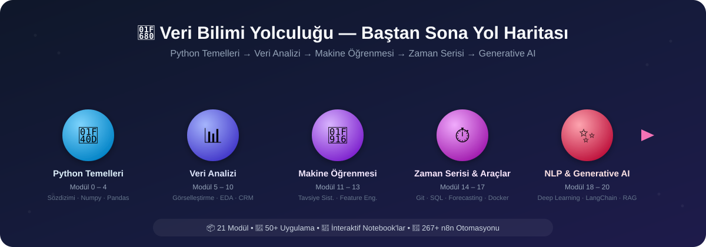

# Alican Kaya Data-Science-RoadMap

[Portfolio](https://alican-kaya.com/) | [LinkedIn](https://www.linkedin.com/in/alican-kaya-881650234/)

🇹🇷 **Türkçe** &nbsp;|&nbsp; 🇬🇧 [English](./README.en.md) &nbsp;|&nbsp; 🇪🇸 [Español](./README.es-ES.md)

---

    [](https://github.com/AlicanKaya192/Data-Science-RoadMap/actions/workflows/python-app.yml)

   

> [!CAUTION]
>Bu projenin yoğun ilgi görmesi sebebiyle Git LFS veri kotası hızla dolabilmektedir. Kotanın dolduğu durumlarda repoyu klonlarsanız PDF dokümanları ve veri setleri eksik inecektir. Tüm dosyalara eksiksiz ulaşabilmek için lütfen GitHub reposundaki 'Son Sürümü İndir' (Download ZIP) seçeneğini kullanınız.

---



> ### *Python'dan Generative AI'a — Kapsamlı Veri Bilimi Yolculuğu* 🚀

### ✨ Öne Çıkanlar

| | |
|---|---|
| 📦 **21 Modül** | Temel Python'dan Generative AI'a kadar uçtan uca müfredat |
| 🧪 **50+ Uygulama & Proje** | Gerçek veri setleri ile uygulamalı çalışmalar |
| 📓 **İnteraktif Notebook'lar** | Görselleştirme ağırlıklı modüllerde çalıştırılmış çıktılarıyla Jupyter Notebook |
| 🤖 **267+ n8n Otomasyon** | Hazır AI workflow koleksiyonu |
| 📄 **100+ PDF Doküman** | Detaylı teorik açıklamalar ve referans materyalleri |
| ✅ **CI Destekli** | Her push'ta lint + smoke test ile doğrulanan kod tabanı |

### 🛠️ Teknoloji Stack

     

     

     

## 📑 İçindekiler
> **Not:** Repository içerisindeki klasörler, öğrenim sırasına göre numaralandırılmıştır. Her modülün detaylı içeriği kendi klasöründeki `README.md` dosyasında yer almaktadır. Lütfen aşağıdaki tablodaki modül adlarına tıklayarak ilgili modüle gidiniz.

* [📌 Repository Hakkında](#-repository-hakkında)
* [📚 Öğrenim Yol Haritası ve İçerikler](#-öğrenim-yol-haritası-ve-i̇çerikler)
* [📂 Ekstra Projeler ve Kaynaklar](#-ekstra-projeler-ve-kaynaklar)
  * [🔄 n8n Otomasyon Koleksiyonu (267+ Hazır Workflow)](#-n8n-otomasyon-koleksiyonu-267-hazır-workflow)
* [📖 Proje Durumu ve İlerleme](#-proje-durumu-ve-ilerleme)
* [💡 Önerilen Çalışma Yöntemleri](#-önerilen-çalışma-yöntemleri)
* [🤝 Katkıda Bulunma](#-katkıda-bulunma)
* [📜 Lisans](#-lisans)

[⬆️ Başa Dön](#-i̇çindekiler)

---

## 📚 Öğrenim Yol Haritası ve İçerikler

| # | Modül | Konu Başlıkları |
|:-:|---|---|
| 0 | [Python Temelleri](./0-Python_Temelleri/README.md) | Giriş, veri tipleri, OOP, dosya/veritabanı işlemleri |
| 1 | [Çalışma Ortamı Ayarları](./01-Çalışma_Ortamı_Ayarları/README.md) | Sanal ortam, paket yönetimi |
| 2 | [Veri Yapıları](./02-Veri_Yapıları/README.md) | String, List, Dictionary, Tuple, Set |
| 3 | [Fonksiyonlar, Koşullar, Döngüler ve Comprehensions](./03-Fonksiyonlar,_Koşullar,_Döngüler_anlamalar/README.md) | `if-else`, döngüler, `lambda`, `map`/`filter`, comprehensions |
| 4 | [Egzersizler (Python ve List Comprehensions)](./04-Egzersizler_Python_ve_List_Comprehensions_/README.md) | Pekiştirme alıştırmaları |
| 5 | [Numpy](./05-Numpy/README.md) | Array oluşturma, indeksleme, fancy index, matematiksel işlemler |
| 6 | [Pandas](./06-Pandas/README.md) | Series/DataFrame, seçim, gruplama, `apply`/`lambda`, join |
| 7 | [Veri Görselleştirme (Matplotlib & Seaborn)](./07-Veri_Görselleştirme_Matplotlib_&_Seaborn/README.md) | Çizgi, sütun, histogram, scatter plot |
| 8 | [Gelişmiş Fonksiyonel Keşifçi Veri Analizi (EDA)](./08-Gelişmiş_Fonksiyonel_Keşifçi_Veri_Analizi/README.md) | Kategorik/sayısal analiz, hedef değişken, korelasyon |
| 9 | [CRM Analitik](./09-CRM_Analitik/README.md) | RFM, Müşteri Yaşam Boyu Değeri (CLTV) |
| 10 | [Ölçümleme Problemleri](./10-Ölçümleme_Problemleri/README.md) | Ürün/yorum puanlama-sıralama, A/B Testing |
| 11 | [Tavsiye Sistemleri](./11-Tavsiye_Sistemleri/README.md) | Birliktelik kuralı, içerik/işbirlikçi filtreleme, matris faktörleştirme |
| 12 | [Feature Engineering (Özellik Mühendisliği)](./12-Feature_Engineering_Özellik_Mühendisliği_/README.md) | Aykırı/eksik değerler, encoding, feature extraction |
| 13 | [Machine Learning (Makine Öğrenimi)](./13-Machine_Learning_Makine_Öğrenimi_/README.md) | Regresyon, KNN, CART, ağaç yöntemleri, case study'ler |
| 14 | [GIT](./14-GIT/README.md) | Versiyon kontrol temelleri ve ileri kullanım |
| 15 | [SQL](./15-SQL/README.md) | Veritabanı yönetimi, sorgulama |
| 16 | [Time Series](./16-Time_Series/README.md) | Smoothing, ARIMA/SARIMA, LightGBM ile tahminleme |
| 17 | [Docker](./17-Docker/README.md) | Konteynerizasyon temelleri |
| 18 | [Deep Learning Path ↗](https://github.com/AlicanKaya192/Deep_Learning_Path) | *(Ayrı repository)* |
| 19 | [Natural Language Processing (NLP)](./19-Natural_Language_Processing_(NLP)/README.md) | Metin ön işleme, duygu analizi, sınıflandırma |
| 20 | [Generative AI & Prompt Engineering](./20-Generative_AI_and_Prompt_Engineer/README.md) | LLM'ler, LangChain, RAG, otonom ajanlar, fine-tuning |

---

## 📌 Repository Hakkında

Bu repository, Python programlama dili öğrenim sürecimde oluşturduğum notları, örnek kodları ve projeleri içeren kapsamlı bir kaynaktır. **Veri Bilimi ve Makine Öğrenimi** yol haritasını takip ederek; temel Python konularından başlayıp, ileri seviye veri analizi, özellik mühendisliği ve makine öğrenimi modellerine kadar uzanan bir yapı sunmaktadır.

Amacım, bu süreçte öğrendiklerimi organize bir şekilde belgelemek ve benzer yoldan geçenler için faydalı bir rehber oluşturmaktır.

[⬆️ Başa Dön](#-i̇çindekiler)

---

> [!CAUTION]
> ## ⚠️ Kritik: Gerekli Bağımlılıkların Kurulumu
> 
> Bu repository'deki kodları çalıştırabilmek için **`requirements.txt`** dosyasındaki tüm kütüphanelerin yüklenmesi gerekmektedir.
> 
> ### `requirements.txt` Nedir?
> Bu dosya, projenin ihtiyaç duyduğu Python kütüphanelerinin listesini içerir. İçeriğinde; **pandas**, **numpy**, **scikit-learn**, **matplotlib**, **seaborn**, **xgboost**, **lightgbm**, **catboost**, **streamlit**, **openai**, **google.generativeai** ve daha birçok veri bilimi, makine öğrenimi ve üretken AI kütüphanesi bulunmaktadır.
>
> `requirements.txt` artık geriye dönük uyumluluk amacıyla üç ayrı dosyayı bir arada kurar. Sadece belirli bir bölümle ilgileniyorsanız daha hafif/hızlı bir kurulum için ilgili dosyayı tek başına da kurabilirsiniz:
> - **`requirements-core.txt`** — Modül 0-13, 16 (Klasik Veri Bilimi & Makine Öğrenimi)
> - **`requirements-nlp.txt`** — Modül 19 (Doğal Dil İşleme)
> - **`requirements-genai.txt`** — Modül 20 (Generative AI, LangChain, Ajanlar)
>
> ### Kurulum Adımları:
> ```bash
> # 1. Repository'yi klonlayın
> git clone https://github.com/AlicanKaya192/Data-Science-RoadMap.git
> 
> # 2. Proje dizinine gidin
> cd Data-Science-RoadMap
> 
> # 3. (Önerilen) Sanal ortam oluşturun ve aktif edin
> python -m venv venv
> # Windows:
> venv\Scripts\activate
> # macOS/Linux:
> source venv/bin/activate
> 
> # 4. Tüm bağımlılıkları yükleyin
> pip install -r requirements.txt
> ```
> 
> **Not:** Bazı kütüphaneler (örn: `google.generativeai`, `openai`) API anahtarı gerektirebilir. Modül 20 (Generative AI) için [`20-Generative_AI_and_Prompt_Engineer/.env.example`](./20-Generative_AI_and_Prompt_Engineer/.env.example) dosyasını `.env` olarak kopyalayıp kendi anahtarlarınızla doldurun.

---

## 📂 Ekstra Projeler ve Kaynaklar

- **Armut ARL Projesi:** Birliktelik Kuralı Öğrenimi (Association Rule Learning) üzerine gerçek hayat senaryosu.
- **CheatSheets:** Python, Pandas, Numpy, Matplotlib, Seaborn, SQL, Docker, Machine Learning ve AI Agents için hızlı başvuru kağıtları.
- **[Datasets](./Datasets_Genel_/README.md):** Çalışmalarda kullanılan veri setleri arşivi. Üçüncü taraf veri setlerinin kaynak ve lisans notları için bağlantıya bakınız.
- **Mülakat Soruları:** Teknik mülakatlara hazırlık için soru ve çözümler.
- **Mentor Çözümleri:** Örnek problemlerin alternatif ve profesyonel çözümleri.
- **Kahoot! Soruları:** Öğrenilen bilgileri test etmek için eğlenceli quizler.
- **[Global CO₂ Analysis & Future Projections](https://github.com/Miuul-Project/Global-CO--Analysis---Future-Projections):** Küresel CO₂ emisyon analizi ve gelecek projeksiyonları projesi. Zaman serisi analizi, veri görselleştirme ve tahminleme modelleri içerir.
    > **Not:** Bu proje, **Machine Learning (13)** ve **Time Series (16)** konularından sonra incelenmelidir.
- **[21 Farklı Python Projesi](https://github.com/AlicanKaya192/21-Farkli-Python-Projeleri):** Python öğrenme yolculuğunda pratik yapmak için hazırlanmış, başlangıçtan ileri seviyeye kadar 21 farklı proje koleksiyonu. Web Scraping, Dijital Masaüstü Saati, QR Kod oluşturma ve daha fazlası.
    > **Not:** Bu projeler, **Python Temelleri (0)** bölümünden sonra bağımsız olarak incelenebilir.


### 🔄 n8n Otomasyon Koleksiyonu (267+ Hazır Workflow)

> **n8n**, açık kaynaklı bir iş akışı otomasyon platformudur. Bu koleksiyon; AI, e-posta, sosyal medya, CRM, doküman işleme ve daha birçok alanda **kullanıma hazır 267+ otomasyon workflow**'u içermektedir. Her workflow, `.txt` formatında n8n'e import edilebilir JSON yapısındadır.
>
> 📁 **Konum:** `n8n-otomasyon/267 otomasyon (n8n) - HAZIR/`
> 📄 **Bonus:** `n8n Cheat Sheet Guide.pdf` — n8n kullanım kılavuzu ve ipuçları

| Kategori | Workflow Sayısı | Açıklama |
|----------|:-:|-----------|
| [🤖 AI Chatbot & Sohbet Botları](#-ai-chatbot--sohbet-botları) | 45 | Telegram, WhatsApp, Discord, Slack ve web tabanlı AI sohbet botları |
| [📧 E-posta Otomasyonu](#-e-posta-otomasyonu) | 28 | Gmail, Outlook üzerinde AI destekli sınıflandırma, özetleme ve otomatik yanıt |
| [📝 İçerik Üretimi & SEO](#-i̇çerik-üretimi--seo) | 25 | Blog, WordPress, sosyal medya içeriği ve SEO optimizasyonu |
| [📊 Veri Analizi & Raporlama](#-veri-analizi--raporlama) | 20 | Google Analytics, veri özeti, sentiment analizi ve raporlama |
| [🧠 RAG & Vektör Veritabanı](#-rag--vektör-veritabanı) | 25 | Retrieval-Augmented Generation, Pinecone, Qdrant, Supabase, ChromaDB |
| [🤖 AI Ajan & Otonom Sistemler](#-ai-ajan--otonom-sistemler) | 22 | LangChain ajanları, araç kullanımı, otonom araştırma ve ReAct |
| [📱 Sosyal Medya Otomasyonu](#-sosyal-medya-otomasyonu) | 15 | Twitter/X, Instagram, LinkedIn, Pinterest ve YouTube otomasyonları |
| [📄 Doküman İşleme & PDF](#-doküman-i̇şleme--pdf) | 18 | PDF parsing, fatura çıkarma, CV analizi ve OCR |
| [🖼️ Görsel & Ses İşleme](#️-görsel--ses-i̇şleme) | 16 | DALL-E, Flux, Stable Diffusion, TTS, STT ve multimodal işlemler |
| [👔 İK & İnsan Kaynakları](#-i̇k--i̇nsan-kaynakları) | 12 | CV tarama, aday değerlendirme, iş ilanı ve mülakat otomasyonu |
| [💼 CRM & Satış](#-crm--satış) | 14 | Lead yönetimi, müşteri takibi, Pipedrive, HubSpot ve satış otomasyonu |
| [🕷️ Web Scraping & Veri Çekme](#️-web-scraping--veri-çekme) | 12 | Web kazıma, Hacker News, Reddit, veri toplama ve dönüştürme |
| [🔒 Güvenlik & IT Ops](#-güvenlik--it-ops) | 8 | SIEM, PII temizleme, güvenlik botları ve IT destek otomasyonu |
| [🔧 Araçlar & Entegrasyonlar](#-araçlar--entegrasyonlar) | 12 | Notion, Google Drive, Todoist, API şablonları ve yardımcı araçlar |

---

<details>
<summary><b>🤖 AI Chatbot & Sohbet Botları</b></summary>

| # | Workflow Adı | Platform / Entegrasyon | Açıklama |
|:-:|-------------|----------------------|----------|
| 1 | AI agent chat | Genel | Temel AI ajan sohbet şablonu |
| 2 | AI chatbot that can search the web | Web Arama | Web araması yapabilen AI sohbet botu |
| 3 | AI Voice Chat using Webhook, Memory Manager, OpenAI, Gemini & ElevenLabs | Webhook, ElevenLabs | Sesli AI sohbet: OpenAI + Gemini + ElevenLabs entegrasyonu |
| 4 | AI Voice Chatbot with ElevenLabs & OpenAI | ElevenLabs | Müşteri hizmetleri ve restoran için sesli AI chatbot |
| 5 | Chat with OpenAI's GPT via Telegram Bot | Telegram, OpenAI | Telegram üzerinden GPT ile sohbet |
| 6 | Chat with local LLMs using n8n and Ollama | Ollama | Yerel LLM'ler ile sohbet (Ollama entegrasyonu) |
| 7 | Chat with OpenAI Assistant (by adding a memory) | OpenAI Assistants | Bellek destekli OpenAI Asistan sohbeti |
| 8 | Chat Assistant with Postgres Memory & API Calling | PostgreSQL, OpenAI | Postgres bellek + API çağırma yetenekli asistan |
| 9 | Telegram AI Chatbot | Telegram | Telegram AI sohbet botu |
| 10 | Telegram AI bot with LangChain nodes | Telegram, LangChain | LangChain tabanlı Telegram AI botu |
| 11 | Telegram AI bot assistant (voice & text) | Telegram | Ses ve metin destekli Telegram AI asistanı |
| 12 | Telegram Bot with Supabase memory & OpenAI assistant | Telegram, Supabase | Supabase bellek + OpenAI Asistan entegrasyonlu Telegram botu |
| 13 | Agentic Telegram AI bot with LangChain & new tools | Telegram, LangChain | Gelişmiş araç destekli Telegram AI ajanı |
| 14 | Telegram chat with PDF | Telegram | Telegram üzerinden PDF ile sohbet |
| 15 | 🤖🧠 AI Agent Chatbot + LONG TERM Memory + Telegram | Telegram | Uzun süreli bellek destekli AI ajan chatbot |
| 16 | 🐋🤖 DeepSeek AI Agent + Telegram + LONG TERM Memory | Telegram, DeepSeek | DeepSeek + uzun süreli bellek Telegram ajanı |
| 17 | Angie, Personal AI Assistant (Telegram Voice & Text) | Telegram | Kişisel AI asistan (ses + metin) |
| 18 | 🤖 Telegram Messaging Agent for Text/Audio/Images | Telegram | Metin, ses ve görsel destekli Telegram ajanı |
| 19 | Building Your First WhatsApp Chatbot | WhatsApp | WhatsApp chatbot geliştirme şablonu |
| 20 | Complete business WhatsApp AI-Powered RAG Chatbot | WhatsApp, RAG | İşletmeler için RAG tabanlı WhatsApp AI chatbot |
| 21 | Respond to WhatsApp Messages with AI | WhatsApp | WhatsApp mesajlarına AI ile otomatik yanıt |
| 22 | Discord AI-powered bot | Discord | Discord AI sohbet botu |
| 23 | Creating a AI Slack Bot with Google Gemini | Slack, Gemini | Google Gemini tabanlı Slack botu |
| 24 | Slack slash commands AI Chat Bot | Slack | Slack slash komutları ile AI sohbet |
| 25 | 🐋 DeepSeek V3 Chat & R1 Reasoning Quick Start | DeepSeek | DeepSeek V3 ve R1 Reasoning hızlı başlangıç |
| 26 | 🔐🦙🤖 Private & Local Ollama Self-Hosted AI Assistant | Ollama | Tamamen yerel, gizli Ollama AI asistanı |
| 27 | Siri AI Agent: Apple Shortcuts powered voice template | Apple Shortcuts | Siri + Apple Shortcuts sesli AI ajan şablonu |
| 28 | Text automations using Apple Shortcuts | Apple Shortcuts | Apple Shortcuts ile metin otomasyonları |
| 29 | AI-Powered Children's Arabic Storytelling on Telegram | Telegram | Çocuklar için Arapça hikaye anlatımı |
| 30 | AI-Powered Children's English Storytelling on Telegram | Telegram, OpenAI | Çocuklar için İngilizce hikaye anlatımı |
| 31 | LINE Assistant with Google Calendar & Gmail | LINE | LINE + Google Calendar + Gmail asistanı |
| 32 | WordPress AI Chatbot with Supabase & OpenAI | WordPress, Supabase | WordPress web sitesi AI chatbot'u |
| 33 | Create a Branded AI-Powered Website Chatbot | Website | Markalı web sitesi AI chatbot oluşturma |
| 34 | BambooHR AI-Powered Company Policies Chatbot | BambooHR | Şirket politikaları ve haklar chatbot'u |
| 35 | AI-powered WooCommerce Support Agent | WooCommerce | WooCommerce destek AI ajanı |
| 36 | vAssistant for Hubspot Chat using OpenAI & Airtable | HubSpot, Airtable | HubSpot sohbet için AI asistan |
| 37 | Bitrix24 Chatbot Application with Webhook Integration | Bitrix24 | Bitrix24 CRM chatbot entegrasyonu |
| 38 | Ask a human for help when the AI doesn't know | Genel | AI bilmediğinde insandan yardım isteme |
| 39 | Conversational Interviews with AI Agents & n8n Forms | n8n Forms | AI ile konuşma tarzında mülakatlar |
| 40 | AI agent for Instagram DM/inbox (Manychat + OpenAI) | Instagram, ManyChat | Instagram DM AI ajan entegrasyonu |
| 41 | Chat with Postgresql Database | PostgreSQL | PostgreSQL veritabanı ile sohbet |
| 42 | Chat with a Google Sheet using AI | Google Sheets | Google Sheets ile AI sohbet |
| 43 | Chat with your event schedule from Google Sheets in Telegram | Google Sheets, Telegram | Etkinlik programı ile Telegram sohbeti |
| 44 | Enhance Customer Chat by Buffering Messages (Twilio & Redis) | Twilio, Redis | Müşteri sohbetini tamponlama ile geliştirme |
| 45 | IT Ops AI SlackBot - Chat with your knowledge base | Slack | IT bilgi tabanı ile Slack sohbet botu |

</details>

<details>
<summary><b>📧 E-posta Otomasyonu</b></summary>

| # | Workflow Adı | Platform / Entegrasyon | Açıklama |
|:-:|-------------|----------------------|----------|
| 1 | A Very Simple "Human in the Loop" Email Response System | IMAP, AI | İnsan onaylı AI e-posta yanıt sistemi |
| 2 | AI-Powered Email Automation: Summarize & Respond with RAG | E-posta, RAG | RAG ile e-posta özetleme ve yanıtlama |
| 3 | AI-powered email processing autoresponder (Yes/No) | E-posta | AI destekli otomatik yanıt (onay/red) |
| 4 | Auto Categorise Outlook Emails with AI | Outlook | Outlook e-postalarını AI ile kategorileme |
| 5 | Auto-label incoming Gmail messages with AI | Gmail | Gmail mesajlarını AI ile etiketleme |
| 6 | Basic Automatic Gmail Email Labelling with OpenAI | Gmail, OpenAI | OpenAI ile Gmail otomatik etiketleme |
| 7 | Compose reply draft in Gmail with OpenAI Assistant | Gmail, OpenAI | Gmail'de AI ile taslak yanıt oluşturma |
| 8 | Effortless Email Management with AI Summarization & Review | E-posta | AI ile e-posta yönetimi ve özetleme |
| 9 | Email Subscription Service with n8n Forms, Airtable & AI | n8n Forms, Airtable | AI destekli e-posta abonelik servisi |
| 10 | Email Summary Agent | E-posta | E-posta özet ajanı |
| 11 | Gmail AI Auto-Responder: Draft Replies to incoming emails | Gmail | Gmail otomatik yanıt taslağı oluşturma |
| 12 | Microsoft Outlook AI Email Assistant | Outlook, Monday, Airtable | Outlook AI e-posta asistanı |
| 13 | Modular & Customizable AI-Powered Email Routing | E-posta, eCommerce | E-ticaret için modüler e-posta yönlendirme |
| 14 | Send a ChatGPT email reply and save to Google Sheets | Gmail, Google Sheets | ChatGPT e-posta yanıtları + Google Sheets kaydı |
| 15 | Send specific PDF attachments from Gmail to Google Drive | Gmail, Google Drive | Gmail PDF eklerini Google Drive'a gönderme |
| 16 | Analyze & Sort Suspicious Email Contents with ChatGPT | Gmail, ChatGPT | Şüpheli e-postaları AI ile analiz ve sıralama |
| 17 | Analyze Suspicious Email Contents with ChatGPT Vision | Gmail, GPT-4 Vision | Görsel AI ile şüpheli e-posta içerik analizi |
| 18 | create e-mail responses with Fastmail & OpenAI | Fastmail, OpenAI | Fastmail + OpenAI ile e-posta yanıtları |
| 19 | Extract spending history from Gmail to Google Sheet | Gmail, Google Sheets | Gmail'den harcama geçmişi çıkarma |
| 20 | Summarize your emails with AI and send to Line messenger | E-posta, LINE | E-posta özetlerini LINE'a gönderme |
| 21 | Turn Emails into AI-Enhanced Tasks in Notion | Gmail, Notion, Airtable | E-postaları AI ile Notion görevlerine dönüştürme |
| 22 | 📈 Receive Daily Market News to Microsoft Outlook | Outlook, FT.com | Günlük piyasa haberlerini Outlook'a alma |
| 23 | Classify lemlist replies using OpenAI | lemlist, OpenAI | lemlist yanıtlarını AI ile sınıflandırma |
| 24 | lemlist + GPT-3: Supercharge sales workflows | lemlist, GPT-3 | Satış e-posta workflow'larını güçlendirme |
| 25 | AI-Powered Information Monitoring with OpenAI & Slack | OpenAI, Google Sheets, Slack | AI ile bilgi izleme ve bildirim |
| 26 | Reconcile Rent Payments with Excel & OpenAI | Excel, OpenAI | Kira ödemelerini AI ile eşleştirme |
| 27 | Handling Appointment Leads with Twilio, Cal.com & AI | Twilio, Cal.com | Randevu takibi ve takip e-postaları |
| 28 | Qualifying Appointment Requests with AI & n8n Forms | n8n Forms | AI ile randevu taleplerini değerlendirme |

</details>

<details>
<summary><b>📝 İçerik Üretimi & SEO</b></summary>

| # | Workflow Adı | Platform / Entegrasyon | Açıklama |
|:-:|-------------|----------------------|----------|
| 1 | Automate Blog Creation in Brand Voice with AI | Blog | Marka sesiyle AI blog içeriği oluşturma |
| 2 | Automate Content Generator for WordPress with DeepSeek R1 | WordPress, DeepSeek | DeepSeek R1 ile WordPress içerik üretimi |
| 3 | Author and Publish Blog Posts From Google Sheets | Google Sheets, WordPress | Google Sheets'ten blog yazısı yayınlama |
| 4 | Write a WordPress post with AI (from keywords) | WordPress, AI | Anahtar kelimelerden WordPress yazısı oluşturma |
| 5 | AI-Generated Summary Block for WordPress Posts | WordPress | WordPress yazıları için AI özet bloğu |
| 6 | Auto-Categorize blog posts in WordPress using AI | WordPress | WordPress yazılarını AI ile kategorileme |
| 7 | Auto-Tag Blog Posts in WordPress with AI | WordPress | WordPress yazılarını AI ile etiketleme |
| 8 | Generate SEO Seed Keywords Using AI | SEO | AI ile SEO anahtar kelime üretimi |
| 9 | Enrich FAQ sections on website pages at scale with AI | SEO, Web | Web sayfalarında AI ile FAQ zenginleştirme |
| 10 | AI Social Media Caption Creator (Airtable) | Airtable, Sosyal Medya | Sosyal medya gönderi açıklamaları oluşturma |
| 11 | Generate Instagram Content from Top Trends with AI | Instagram, AI Image | Trend tabanlı Instagram içeriği üretimi |
| 12 | Generate 9:16 Images from Content & Brand Guidelines | Görsel Üretim | Marka kılavuzuna uygun 9:16 görsel üretimi |
| 13 | OpenAI-powered tweet generator | Twitter/X | OpenAI ile tweet üretimi |
| 14 | Speed Up Social Media Banners With BannerBear | BannerBear | Hızlı sosyal medya banner üretimi |
| 15 | Hacker News to Video Content | Hacker News, Video | Hacker News içeriklerinden video oluşturma |
| 16 | 🔍 Perplexity Research to HTML: AI-Powered Content | Perplexity AI | Perplexity araştırmasından HTML içerik üretimi |
| 17 | 📚 Auto-generate documentation for n8n workflows with GPT | GPT, Docsify | n8n workflow dokümantasyonu otomatik oluşturma |
| 18 | Dynamically generate a webpage from user request (OpenAI) | OpenAI | Kullanıcı isteğinden dinamik web sayfası üretimi |
| 19 | AI Youtube Trend Finder Based On Niche | YouTube | Niş bazlı YouTube trend bulucu |
| 20 | Optimize & Update Printify Title and Description | Printify | Printify ürün başlık ve açıklama optimizasyonu |
| 21 | Daily Podcast Summary | Podcast | Günlük podcast özeti |
| 22 | AI: Summarize podcast & enhance using Wikipedia | Podcast, Wikipedia | Podcast özetleme + Wikipedia ile zenginleştirme |
| 23 | Share YouTube Videos with AI Summaries on Discord | YouTube, Discord | YouTube videolarını AI özetleriyle Discord'da paylaşma |
| 24 | Summarize YouTube Videos from Transcript | YouTube | YouTube video transkriptlerinden özet oluşturma |
| 25 | ⚡AI-Powered YouTube Video Summarization & Analysis | YouTube, AI | AI destekli YouTube video analizi ve özetleme |

</details>

<details>
<summary><b>📊 Veri Analizi & Raporlama</b></summary>

| # | Workflow Adı | Platform / Entegrasyon | Açıklama |
|:-:|-------------|----------------------|----------|
| 1 | AI Customer feedback sentiment analysis | AI, NLP | Müşteri geri bildirim duygu analizi |
| 2 | Analyze feedback and send a message on Mattermost | Mattermost | Geri bildirim analizi ve Mattermost bildirimi |
| 3 | Analyze feedback using AWS Comprehend & Mattermost | AWS Comprehend | AWS Comprehend ile duygu analizi |
| 4 | Create a Google Analytics Data Report with AI | Google Analytics | AI ile Google Analytics raporu oluşturma |
| 5 | Send Google Analytics data to AI & save to Baserow | Google Analytics, Baserow | Analytics verilerini AI ile analiz edip Baserow'a kaydetme |
| 6 | Visualize your SQL Agent queries with OpenAI & Quickchart | SQL, Quickchart | SQL sorgu sonuçlarını AI ile görselleştirme |
| 7 | Sentiment Analysis Tracking on Support Issues (Linear & Slack) | Linear, Slack | Destek biletlerinde duygu analizi takibi |
| 8 | Summarize Google Sheets form feedback via GPT-4 | Google Sheets, GPT-4 | Google Form geri bildirimlerini özetleme |
| 9 | Summarize SERPBear data with AI & save to Baserow | SERPBear, Baserow | SEO verilerini AI ile özetleme |
| 10 | Summarize Umami data with AI & save to Baserow | Umami, Baserow | Umami analytics verilerini AI ile özetleme |
| 11 | AI Fitness Coach: Strava Data Analysis & Training Insights | Strava | AI ile Strava fitness veri analizi |
| 12 | Analyze tradingview.com charts with Chrome extension & OpenAI | TradingView, OpenAI | TradingView grafiklerini AI ile analiz |
| 13 | AI Crew to Automate Fundamental Stock Analysis | AI Crew | AI ile temel hisse senedi analizi otomasyonu |
| 14 | AI-Powered RAG Workflow For Stock Earnings Report Analysis | RAG, Finans | Hisse senedi kazanç raporu AI analizi |
| 15 | Monthly Spotify Track Archiving & Playlist Classification | Spotify | Aylık Spotify müzik sınıflandırma ve arşivleme |
| 16 | UTM Link Creator & QR Code Generator with GA Reports | Google Analytics | UTM link oluşturma + QR kod + GA raporları |
| 17 | Add positive feedback messages to a table in Notion | Notion | Olumlu geri bildirimleri Notion tablosuna ekleme |
| 18 | Prepare CSV files with GPT-4 | GPT-4 | GPT-4 ile CSV dosyaları hazırlama |
| 19 | Force AI to use a specific output format | AI | AI çıktı formatını zorlama tekniği |
| 20 | 🚀 Local Multi-LLM Testing & Performance Tracker | Ollama | Yerel çoklu LLM test ve performans takibi |

</details>

<details>
<summary><b>🧠 RAG & Vektör Veritabanı</b></summary>

| # | Workflow Adı | Platform / Entegrasyon | Açıklama |
|:-:|-------------|----------------------|----------|
| 1 | Ask questions about a PDF using AI | PDF, RAG | PDF belgelerine AI ile soru sorma |
| 2 | Chat with PDF docs using AI (quoting sources) | PDF, RAG | Kaynak göstererek PDF ile sohbet |
| 3 | AI Agent To Chat With Files In Supabase Storage | Supabase | Supabase'deki dosyalarla AI sohbet |
| 4 | AI Agent to chat with Supabase/PostgreSQL DB | Supabase, PostgreSQL | Supabase/PostgreSQL ile AI sohbet |
| 5 | AI Agent to chat with your Search Console Data | Google Search Console | Search Console verileriyle AI sohbet |
| 6 | AI Agent to chat with Airtable and analyze data | Airtable | Airtable verileriyle AI sohbet ve analiz |
| 7 | AI chat with any data source (n8n workflow tool) | n8n | Herhangi bir veri kaynağı ile AI sohbet |
| 8 | AI: Ask questions about any data source (n8n retriever) | n8n | Herhangi bir veri kaynağından soru sorma |
| 9 | Chat with GitHub API Documentation: RAG with Pinecone & OpenAI | GitHub, Pinecone | GitHub API dokümantasyonu ile RAG sohbet |
| 10 | Notion to Pinecone Vector Store Integration | Notion, Pinecone | Notion sayfalarını Pinecone'a vektörleştirme |
| 11 | Store Notion's Pages as Vectors into Supabase with OpenAI | Notion, Supabase | Notion sayfalarını Supabase'e vektör olarak kaydetme |
| 12 | Upsert huge documents in a vector store (Supabase & Notion) | Supabase, Notion | Büyük dokümanları vektör deposuna yükleme |
| 13 | Supabase Insertion & Upsertion & Retrieval | Supabase | Supabase vektör veritabanı işlemleri |
| 14 | Building RAG Chatbot for Movie Recommendations with Qdrant | Qdrant, OpenAI | Film öneri RAG chatbot'u |
| 15 | Build a Financial Documents Assistant (Qdrant & Mistral) | Qdrant, Mistral | Finansal doküman AI asistanı |
| 16 | Build a Tax Code Assistant (Qdrant, Mistral & OpenAI) | Qdrant, Mistral | Vergi kodu AI asistanı |
| 17 | Recipe Recommendations with Qdrant and Mistral | Qdrant, Mistral | Tarif önerisi sistemi |
| 18 | Breakdown Documents into Study Notes (MistralAI & Qdrant) | Qdrant, Mistral | Dokümanları çalışma notlarına dönüştürme |
| 19 | Customer Insights with Qdrant, Python & Information Extractor | Qdrant, Python | Müşteri içgörüleri çıkarma |
| 20 | Survey Insights with Qdrant, Python & Information Extractor | Qdrant, Python | Anket içgörüleri çıkarma |
| 21 | RAG Chatbot for Company Documents (Google Drive & Gemini) | Google Drive, Gemini | Şirket dokümanları RAG chatbot |
| 22 | RAG Context-Aware Chunking (Google Drive to Pinecone) | Google Drive, Pinecone | Bağlam farkındalıklı parçalama |
| 23 | KB Tool - Confluence Knowledge Base | Confluence | Confluence bilgi tabanı aracı |
| 24 | Notion knowledge base AI assistant | Notion | Notion bilgi tabanı AI asistanı |
| 25 | Notion AI Assistant Generator | Notion | Notion AI asistan oluşturucu |

</details>

<details>
<summary><b>🤖 AI Ajan & Otonom Sistemler</b></summary>

| # | Workflow Adı | Platform / Entegrasyon | Açıklama |
|:-:|-------------|----------------------|----------|
| 1 | AI agent that can scrape webpages | Web Scraping | Web sayfası kazıyabilen AI ajan |
| 2 | AI Agent with Ollama for current weather & wiki | Ollama | Hava durumu ve Wikipedia AI ajanı |
| 3 | AI Agent / Google Calendar assistant using OpenAI | Google Calendar | Google Calendar AI asistanı |
| 4 | AI Agent for project management & meetings (Airtable & Fireflies) | Airtable, Fireflies | Proje yönetimi ve toplantı AI ajanı |
| 5 | AI Agent for realtime insights on meetings | Toplantı | Gerçek zamanlı toplantı içgörü ajanı |
| 6 | Host Your Own AI Deep Research Agent (n8n, Apify, OpenAI o3) | Apify, OpenAI o3 | Derin araştırma AI ajanı barındırma |
| 7 | Open Deep Research - AI-Powered Autonomous Research | Araştırma | Açık kaynak otonom araştırma workflow'u |
| 8 | Autonomous AI crawler | Web | Otonom AI web tarayıcı |
| 9 | Advanced AI Demo (AI Developers #14 meetup) | Genel | Gelişmiş AI demo workflow'u |
| 10 | Custom LangChain agent written in JavaScript | LangChain, JS | JavaScript ile özel LangChain ajanı |
| 11 | OpenAI Assistant workflow: upload file, create, chat | OpenAI Assistants | OpenAI Asistan: dosya yükle, oluştur, sohbet et |
| 12 | OpenAI assistant with custom tools | OpenAI Assistants | Özel araçlı OpenAI Asistan |
| 13 | Build an OpenAI Assistant with Google Drive Integration | OpenAI, Google Drive | Google Drive entegrasyonlu OpenAI Asistan |
| 14 | Make OpenAI Citation for File Retrieval RAG | OpenAI | OpenAI ile dosya alıntılama RAG |
| 15 | Talk to your SQLite database with a LangChain AI Agent | SQLite, LangChain | SQLite veritabanı ile LangChain sohbet |
| 16 | Generate SQL queries from schema only (AI-powered) | SQL, AI | Şema tabanlı AI SQL sorgu üretimi |
| 17 | Query n8n Credentials with AI SQL Agent | n8n, SQL | n8n kimlik bilgilerini AI SQL ajanıyla sorgulama |
| 18 | Using External Workflows as Tools in n8n | n8n | Harici workflow'ları araç olarak kullanma |
| 19 | Introduction to the HTTP Tool | n8n | HTTP aracına giriş |
| 20 | 🔥📈🤖 AI Agent for n8n Creators Leaderboard | n8n | n8n yaratıcı sıralaması AI ajanı |
| 21 | 🤖🧑‍💻 AI Agent for Top n8n Creators Leaderboard Reporting | n8n | n8n üst sıra yaratıcı raporlama ajanı |
| 22 | Proxmox AI Agent with n8n & Generative AI | Proxmox | Proxmox sunucu yönetimi AI ajanı |

</details>

<details>
<summary><b>📱 Sosyal Medya Otomasyonu</b></summary>

| # | Workflow Adı | Platform / Entegrasyon | Açıklama |
|:-:|-------------|----------------------|----------|
| 1 | AI-Powered Social Media Amplifier | Sosyal Medya | AI destekli sosyal medya güçlendirici |
| 2 | Social Media Analysis and Automated Email Generation | Sosyal Medya, E-posta | Sosyal medya analizi + otomatik e-posta |
| 3 | Post New YouTube Videos to X | YouTube, Twitter/X | Yeni YouTube videolarını X'te paylaşma |
| 4 | Create dynamic Twitter profile banner | Twitter/X | Dinamik Twitter profil banner'ı oluşturma |
| 5 | Update Twitter banner using HTTP request | Twitter/X | HTTP ile Twitter banner güncelleme |
| 6 | Twitter Virtual AI Influencer | Twitter/X | Sanal AI influencer (Twitter) |
| 7 | Upload to Instagram and TikTok from Google Drive | Instagram, TikTok | Google Drive'dan Instagram ve TikTok'a yükleme |
| 8 | Automate Pinterest Analysis & AI Content Suggestions | Pinterest | Pinterest analizi ve AI içerik önerileri |
| 9 | Automate LinkedIn Outreach with Notion & OpenAI | LinkedIn, Notion | LinkedIn sosyal erişim otomasyonu |
| 10 | Reddit AI digest | Reddit | Reddit AI özet derlemesi |
| 11 | Send daily translated Calvin and Hobbes Comics to Discord | Discord | Günlük çevrilimiş Calvin ve Hobbes çizgi romanları |
| 12 | Telegram to Spotify with OpenAI | Telegram, Spotify | Telegram'dan Spotify'a AI ile müzik ekleme |
| 13 | Automate Sales Meeting Prep with AI & APIFY (WhatsApp) | WhatsApp, Apify | Satış toplantısı hazırlığı + WhatsApp bildirimi |
| 14 | Detect toxic language in Telegram messages | Telegram | Telegram'da toksik dil tespiti |
| 15 | Get Airtable data via AI and Obsidian Notes | Airtable, Obsidian | Airtable verilerini AI ile Obsidian notlarına alma |

</details>

<details>
<summary><b>📄 Doküman İşleme & PDF</b></summary>

| # | Workflow Adı | Platform / Entegrasyon | Açıklama |
|:-:|-------------|----------------------|----------|
| 1 | Invoice data extraction with LlamaParse & OpenAI | LlamaParse, OpenAI | Fatura verisi çıkarma (LlamaParse) |
| 2 | Parse PDF with LlamaParse and save to Airtable | LlamaParse, Airtable | PDF parse edip Airtable'a kaydetme |
| 3 | Extract and process info from PDF (Claude & Gemini) | Claude, Gemini | Claude ve Gemini ile PDF bilgi çıkarma |
| 4 | Extract text from PDF & image using Vertex AI to CSV | Vertex AI, Gemini | PDF/görsel'den metin çıkarıp CSV'ye kaydetme |
| 5 | Manipulate PDF with Adobe developer API | Adobe API | Adobe API ile PDF manipülasyonu |
| 6 | Extract data from resume and create PDF with Gotenberg | Gotenberg | CV verisi çıkarma + PDF oluşturma |
| 7 | AI Data Extraction with Dynamic Prompts (Airtable) | Airtable | Dinamik promptlarla AI veri çıkarma |
| 8 | AI Data Extraction with Dynamic Prompts (Baserow) | Baserow | Dinamik promptlarla AI veri çıkarma |
| 9 | Extract Information from Logo Sheet (forms, AI, Google Sheet) | Google Sheets, Airtable | Logo sayfasından bilgi çıkarma |
| 10 | Extract license plate number from image via n8n form | n8n Forms | Plaka numarası çıkarma (görsel) |
| 11 | Extract personal data with self-hosted LLM Mistral NeMo | Mistral NeMo | Yerel LLM ile kişisel veri çıkarma |
| 12 | Convert URL HTML to Markdown Format & Get Page Links | Web | URL HTML'yi Markdown'a dönüştürme |
| 13 | Summarize the New Documents from Google Drive | Google Drive, Google Sheets | Google Drive dokümanlarını özetleme |
| 14 | Transcribing Bank Statements To Markdown Using Gemini Vision | Gemini Vision | Banka ekstrelerini Markdown'a dönüştürme |
| 15 | ETL pipeline for text processing | ETL | Metin işleme ETL pipeline'ı |
| 16 | Analyse papers from Hugging Face with AI & store in Notion | Hugging Face, Notion | HuggingFace makalelerini AI ile analiz etme |
| 17 | Automated Hugging Face Paper Summary & Categorization | Hugging Face | HuggingFace makale özetleme ve sınıflandırma |
| 18 | API Schema Extractor | API | API şeması çıkarma aracı |

</details>

<details>
<summary><b>🖼️ Görsel & Ses İşleme</b></summary>

| # | Workflow Adı | Platform / Entegrasyon | Açıklama |
|:-:|-------------|----------------------|----------|
| 1 | Configure your own Image Creation API Using DALL-E 3 | DALL-E 3 | DALL-E 3 ile görsel oluşturma API'si |
| 2 | Image Creation with OpenAI and Telegram | OpenAI, Telegram | OpenAI + Telegram ile görsel oluşturma |
| 3 | Flux AI Image Generator | Flux | Flux AI görsel üretici |
| 4 | Flux Dev Image Generation (Fal.ai) to Google Drive | Fal.ai, Google Drive | Flux görsel üretimi ve Drive'a kaydetme |
| 5 | 🎨 Interactive Image Editor with FLUX.1 Fill Tool | Flux | Flux ile interaktif görsel düzenleme (inpainting) |
| 6 | Transform Image to Lego Style Using Line and DALL-E | LINE, DALL-E | Görseli Lego stiline dönüştürme |
| 7 | Automate Image Validation Tasks using AI Vision | AI Vision | AI Vision ile görsel doğrulama otomasyonu |
| 8 | Automatic Background Removal for Images in Google Drive | Google Drive | Google Drive'daki görsellerde arka plan kaldırma |
| 9 | Prompt-based Object Detection with Gemini 2.0 | Gemini 2.0 | Gemini 2.0 ile prompt tabanlı nesne tespiti |
| 10 | Easy Image Captioning with Gemini 1.5 Pro | Gemini 1.5 Pro | Gemini ile kolay görsel açıklama oluşturma |
| 11 | Generating Image Embeddings via Textual Summarisation | AI | Metin özetleme ile görsel embedding üretimi |
| 12 | Build Your Own Image Search (AI Object Detection, CDN, ElasticSearch) | ElasticSearch | AI nesne tespiti ile görsel arama motoru |
| 13 | Narrating over a Video using Multimodal AI | Multimodal AI | Çoklu-modal AI ile video üzerine anlatım |
| 14 | OpenAI examples: ChatGPT, DALL-E 2, Whisper—5-in-1 | OpenAI | 5'i 1 arada OpenAI örnekleri |
| 15 | Convert text to speech with OpenAI | OpenAI TTS | OpenAI ile metin-konuşma dönüşümü |
| 16 | Generate Text-to-Speech Using ElevenLabs | ElevenLabs | ElevenLabs ile metin-konuşma üretimi |
| 17 | Generate audio from text using OpenAI (Webhook TTS) | OpenAI, Webhook | Webhook ile metin-konuşma dönüşümü |
| 18 | Translate audio using AI | AI | AI ile ses çevirisi |
| 19 | Translate Telegram audio messages with AI (55 languages) | Telegram | 55 dilde Telegram ses mesajı çevirisi |
| 20 | Transcribe Audio Files, Summarize with GPT-4, store in Notion | GPT-4, Notion | Ses dosyası transkripsiyon + özet + Notion kaydı |

</details>

<details>
<summary><b>👔 İK & İnsan Kaynakları</b></summary>

| # | Workflow Adı | Platform / Entegrasyon | Açıklama |
|:-:|-------------|----------------------|----------|
| 1 | AI Automated HR Workflow for CV Analysis & Evaluation | HR, AI | CV analizi ve aday değerlendirme otomasyonu |
| 2 | AI-Powered Candidate Shortlisting for ERPNext | ERPNext | ERPNext için AI aday ön eleme |
| 3 | CV Resume PDF Parsing with Multimodal Vision AI | Vision AI | Multimodal AI ile CV PDF parse etme |
| 4 | CV Screening with OpenAI | OpenAI | OpenAI ile CV tarama |
| 5 | Screen Applicants With AI, notify HR & save to Google Sheet | AI, Google Sheets | Başvuruları AI ile eleme + HR bildirimi |
| 6 | HR Job Posting and Evaluation with AI | HR | AI ile iş ilanı oluşturma ve değerlendirme |
| 7 | Handling Job Application Submissions with AI & n8n Forms | n8n Forms | AI ile iş başvurusu yönetimi |
| 8 | Spot Workplace Discrimination Patterns with AI | AI, HR | AI ile iş yeri ayrımcılık kalıplarını tespit etme |
| 9 | HR & IT Helpdesk Chatbot with Audio Transcription | Chatbot | İK & IT yardım masası chatbot'u (ses destekli) |
| 10 | Actioning Your Meeting Next Steps using Transcripts & AI | Toplantı | Toplantı transkriptlerinden aksiyon çıkarma |
| 11 | Daily meetings summarization with Gemini AI | Gemini | Günlük toplantı özetleme (Gemini) |
| 12 | Zoom AI Meeting Assistant (mail summary, ClickUp tasks) | Zoom, ClickUp | Zoom toplantı asistanı + görev oluşturma |

</details>

<details>
<summary><b>💼 CRM & Satış</b></summary>

| # | Workflow Adı | Platform / Entegrasyon | Açıklama |
|:-:|-------------|----------------------|----------|
| 1 | AI-Driven Lead Management & Inquiry Automation (ERPNext) | ERPNext | ERPNext ile AI destekli lead yönetimi |
| 2 | AI web researcher for sales | Web, AI | Satış için AI web araştırmacısı |
| 3 | Automate Competitor Research (Exa.ai, Notion, AI Agents) | Exa.ai, Notion | Rakip araştırma otomasyonu |
| 4 | Qualify new leads in Google Sheets via GPT-4 | Google Sheets, GPT-4 | Google Sheets'teki leadleri GPT-4 ile niteleme |
| 5 | Qualify replies from Pipedrive persons with AI | Pipedrive | Pipedrive yanıtlarını AI ile değerlendirme |
| 6 | Enrich Pipedrive Organization Data with GPT-4o & Slack | Pipedrive, Slack | Pipedrive organizasyon verilerini AI ile zenginleştirme |
| 7 | MongoDB AI Agent - Intelligent Movie Recommendations | MongoDB | MongoDB ile akıllı film önerileri |
| 8 | Suggest meeting slots using AI | AI, Takvim | AI ile toplantı zamanı önerme |
| 9 | Personal Shopper Chatbot for WooCommerce (RAG, OpenAI) | WooCommerce, RAG | WooCommerce kişisel alışveriş chatbot'u |
| 10 | Automate Your RFP Process with OpenAI Assistants | OpenAI Assistants | RFP sürecini AI ile otomatikleştirme |
| 11 | Customer Support Channel & Ticketing (Slack & Linear) | Slack, Linear | Müşteri destek kanalı ve biletleme sistemi |
| 12 | Automate Customer Support Issue Resolution (AI Text Classifier) | AI | Müşteri destek sorunlarını AI ile çözme |
| 13 | Simple Expense Tracker with n8n Chat, AI Agent & Google Sheets | Google Sheets | Basit harcama takipçisi (AI + Google Sheets) |
| 14 | Automate testimonials in Strapi with n8n | Strapi | Strapi'de referans yönetimi otomasyonu |

</details>

<details>
<summary><b>🕷️ Web Scraping & Veri Çekme</b></summary>

| # | Workflow Adı | Platform / Entegrasyon | Açıklama |
|:-:|-------------|----------------------|----------|
| 1 | Ultimate Scraper Workflow for n8n | n8n | n8n için kapsamlı web scraper |
| 2 | AI Powered Web Scraping (Jina, Google Sheets, OpenAI) | Jina, Google Sheets | AI destekli web kazıma (kolay yol) |
| 3 | ✨ Vision-Based AI Agent Scraper (Google Sheets, ScrapingBee, Gemini) | ScrapingBee, Gemini | Görsel tabanlı AI scraper |
| 4 | Scrape and summarize webpages with AI | Web, AI | Web sayfalarını kazıyıp AI ile özetleme |
| 5 | Scrape and summarize posts without RSS (AI, NocoDB) | NocoDB | RSS'siz haber sitesi kazıma ve AI özetleme |
| 6 | Scrape Trustpilot Reviews (DeepSeek + OpenAI Sentiment) | Trustpilot, DeepSeek | Trustpilot yorum kazıma + duygu analizi |
| 7 | Hacker News Job Listing Scraper & Parser | Hacker News | Hacker News iş ilanı kazıma ve ayrıştırma |
| 8 | Hacker News Throwback Machine | Hacker News | Hacker News geçmiş yıl popüler içerikleri |
| 9 | Learn Anything from HN - Resource Recommendations | Hacker News | HN'den kaynak önerileri çıkarma |
| 10 | Extract insights & analyse YouTube comments via AI Agent | YouTube | YouTube yorum analizi (AI ajan chat) |
| 11 | Deduplicate Scraping AI Grants for Eligibility | AI, Web | AI hibe kazıma ve dedup |
| 12 | Enrich Property Inventory Survey (Image Recognition & AI) | AI Vision | Mülk envanter anketini AI ile zenginleştirme |

</details>

<details>
<summary><b>🔒 Güvenlik & IT Ops</b></summary>

| # | Workflow Adı | Platform / Entegrasyon | Açıklama |
|:-:|-------------|----------------------|----------|
| 1 | Automate SIEM Alert Enrichment (MITRE ATT&CK, Qdrant, Zendesk) | SIEM, Qdrant, Zendesk | SIEM alarm zenginleştirme (MITRE ATT&CK) |
| 2 | Enhance Security Operations with Qualys Slack Shortcut Bot | Qualys, Slack | Qualys güvenlik işlemleri Slack botu |
| 3 | Remove PII from CSV Files with OpenAI | OpenAI | CSV dosyalarından kişisel veri (PII) temizleme |
| 4 | Visual Regression Testing with Apify & AI Vision | Apify, AI Vision | AI Vision ile görsel regresyon testi |
| 5 | ChatGPT Automatic Code Review in Gitlab MR | GitLab, ChatGPT | GitLab MR'da AI otomatik kod inceleme |
| 6 | Classify new bugs in Linear with GPT-4 | Linear, GPT-4 | Linear'daki hataları GPT-4 ile sınıflandırma |
| 7 | Venafi Cloud Slack Cert Bot | Venafi, Slack | Venafi sertifika yönetimi Slack botu |
| 8 | Detect hallucinations using Ollama bespoke-minicheck | Ollama | Özel Ollama modeli ile halüsinasyon tespiti |

</details>

<details>
<summary><b>🔧 Araçlar & Entegrasyonlar</b></summary>

| # | Workflow Adı | Platform / Entegrasyon | Açıklama |
|:-:|-------------|----------------------|----------|
| 1 | Organise Your Local File Directories With AI | Dosya Sistemi | AI ile yerel dosya dizinlerini düzenleme |
| 2 | Use AI to organize your Todoist Inbox | Todoist | Todoist gelen kutusunu AI ile düzenleme |
| 3 | Automate Screenshots with URLbox & Analyze with AI | URLbox | URL ekran görüntüsü + AI analiz |
| 4 | Create, update, and get a profile in Humantic AI | Humantic AI | Humantic AI profil yönetimi |
| 5 | Query Perplexity AI from your n8n workflows | Perplexity AI | n8n'den Perplexity AI sorgulama |
| 6 | Use OpenRouter in n8n versions ≤1.78 | OpenRouter | n8n'de OpenRouter kullanımı |
| 7 | Fetch Dynamic Prompts from GitHub & Auto-Populate | GitHub | GitHub'dan dinamik prompt çekme |
| 8 | Send a random recipe once a day to Telegram | Telegram | Günlük rastgele tarif gönderimi |
| 9 | Intelligent Web Query & Semantic Re-Ranking (Brave, Gemini) | Brave, Gemini | Akıllı web sorgusu ve semantik sıralama |
| 10 | Obsidian Notes Read Aloud using AI (Podcast Feed) | Obsidian | Obsidian notlarını AI ile sesli okuma |
| 11 | Vector DB as Big Data Analysis Tool for AI Agents | Vektör DB | Vektör veritabanı ile büyük veri analizi (5 parça) |
| 12 | n8n Tips and Tricks | n8n | n8n ipuçları ve püf noktaları |

</details>

> **📌 Not:** Her workflow dosyası, n8n platformuna doğrudan import edilebilir JSON formatındadır. Kullanmak için:
> 1. n8n arayüzünde **Workflows → Import from File** seçeneğini kullanın.
> 2. İlgili `.txt` dosyasını seçip import edin.
> 3. Gerekli API anahtarlarını ve bağlantı bilgilerini kendi hesap bilgilerinizle güncelleyin.

[⬆️ Başa Dön](#-i̇çindekiler)

---

## 📖 Proje Durumu ve İlerleme

  

Yukarıdaki [Öğrenim Yol Haritası](#-öğrenim-yol-haritası-ve-i̇çerikler) tablosundaki **21 modülün tamamı tamamlanmış** durumdadır.

**Not:** 18, 19 ve 20. maddelerin sıralaması ihtiyaca göre değiştirilebilir. Gerekli görülen ek başlıklar ilave edilecektir. Ayrıca, bilinmesi gereken matematiksel konular da kapsama dahil edilecektir.

[⬆️ Başa Dön](#-i̇çindekiler)

---

## 💡 Önerilen Çalışma Yöntemleri

1. **Sırayı Takip Edin:** Konular birbirinin üzerine inşa edildiği için klasör numaralarına göre ilerlemeniz tavsiye edilir.
2. **Uygulama Yapın:** Sadece kodları okumak yerine, [`Datasets_Genel_`](./Datasets_Genel_/README.md) klasöründeki verileri kullanarak kendi analizlerinizi yapın.
3. **Projeleri İnceleyin:** Özellikle `09-CRM_Analitik` ve `13-Machine_Learning_Makine_Öğrenimi_` klasörlerindeki uçtan uca projeleri (pipeline) anlamaya çalışın.

### Algoritma ve Kod Pratiği Siteleri
* **Hackerrank:** Başlangıç ve orta seviye sorular için.
* **Codewars:** Küçük, pratik odaklı görevler.
* **Leetcode:** Orta ve ileri seviye kullanıcılar için (önce Hackerrank/Codewars yapılmalı).
* **Spoj:** Sadece sorular içerir, kod editörü yok. Diğer sitelerden sonra kullanılabilir.

> **Not:** Bu sitelere istediğiniz zaman girip ufak pratikler yapabilirsiniz. Veri seti pratiğine daha fazla vakit ayırmanız önerilir.

[⬆️ Başa Dön](#-i̇çindekiler)

---

## 🤝 Katkıda Bulunma

Bu kaynakların geliştirilmesine katkıda bulunmak isteyenler için PR (Pull Request) ve issue'lar açmak tamamen açıktır. Detaylı adımlar, kod standartları ve test çalıştırma talimatları için **[CONTRIBUTING.md](./CONTRIBUTING.md)** dosyasına bakınız.

Katkıda bulunmadan önce lütfen **[CODE_OF_CONDUCT.md](./CODE_OF_CONDUCT.md)**'yi okuyunuz. Bir güvenlik açığı bulduysanız **[SECURITY.md](./SECURITY.md)**'deki bildirim sürecini takip ediniz.

### Hızlı Başlangıç

```bash
# 1. Repository'yi fork edin (GitHub üzerinden)

# 2. Fork'unuzu klonlayın
git clone https://github.com/KULLANICI_ADINIZ/Data-Science-RoadMap.git

# 3. Yeni bir branch oluşturun
git checkout -b feature/yeni-ozellik

# 4. Değişikliklerinizi yapın ve commit edin
git add .
git commit -m "feat: Yeni özellik açıklaması"

# 5. Branch'inizi push edin
git push origin feature/yeni-ozellik

# 6. GitHub üzerinden Pull Request açın (PR şablonundaki kontrol listesini doldurun)
```

---

## 📜 Lisans

Bu proje **MIT License** altında lisanslanmıştır. Detaylar için [LICENSE](LICENSE) dosyasına bakınız.

> **Özet:** Bu repository açık kaynaklıdır. İçerikleri kişisel, ticari veya eğitim amaçlı kullanabilir, değiştirebilir ve dağıtabilirsiniz. Ancak kaynağın belirtilmesi (atıf yapılması) ve lisans bildiriminin korunması gerekmektedir. Projenin açık kaynak doğasına katkı vermeniz her zaman takdir edilir.

[⬆️ Başa Dön](#-i̇çindekiler)
